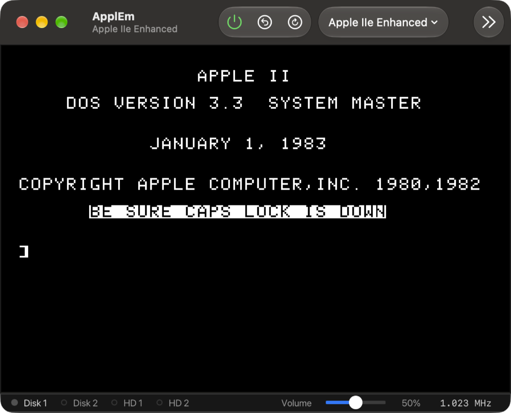

# 1. Getting started

## Installing ApplEm

ApplEm runs on macOS 15 or later. The released app is built for Mac computers with Apple silicon.

1. Open the disk image, `ApplEm-Native-<version>.dmg`.
2. Drag **ApplEm** onto the **Applications** folder beside it.
3. Eject the disk image and open ApplEm from Applications or Launchpad.

The app is signed and notarised by Apple, so it opens without a security
warning.

To build ApplEm from its source instead, see the repository's
[README](../../README.md).

## The first launch

The first time you open ApplEm, you get a single window: an **Apple IIe
Enhanced**, switched on. Every other window, such as the disk drives or the
debugger, stays closed until you open it. After that, ApplEm remembers which
windows you had open and where, and puts them back each time it starts.

With no disk in its drives, the //e shows `Apple //e` at the top of the
screen and waits for a disk to start from. That is what a real //e does too.

To get to Applesoft BASIC's `]` prompt without a disk, press **⌃F12**
(Control-F12), which is the Apple's Control-Reset. To start from a disk, see
[Starting from a disk](#starting-from-a-disk) below.



The main window has three parts:

- **The toolbar**, across the top:

  | Button | What it does |
  | --- | --- |
  | **Power** | Switches the machine on or off. It is green while on |
  | **Reset** | Presses Control-Reset |
  | **Reboot** | Restarts the machine from cold |
  | **Machine** pop-up | Chooses another of the four machines |
  | **Disks** | Shows the disk drives |
  | **SmartPort** | Shows the hard drives |
  | **Slots** | Shows the expansion slots |
  | **Joystick** | Shows the joystick |
  | **Display** | Shows the display settings |
  | **States** | Shows the save states |

  When the window is narrow, the buttons that don't fit are under the **»**
  button at the right. You can rearrange the toolbar by right-clicking it and
  choosing **Customize Toolbar…**.
- **The screen**: the Apple II's picture.
- **The status bar**, along the bottom. From left to right it shows:
  - a light for each drive: green while busy, and red while writing (the
    5.25" and hard drive lights; a IIgs's 3.5" drive lights stay green);
  - hints about the keyboard, such as **⌥ is Open Apple**;
  - the volume control;
  - the speed the machine is running at.

  **View › Status Bar** (⌘/) hides or shows it.

Everything else ApplEm has opens in a window of its own: the disk drives,
the debugger, the display settings and so on. They are listed in the
**Window** and **Debug** menus, and each one remembers whether it was open
and where it was the next time you start ApplEm.

## Typing into the machine

Click the screen, and the Mac's keyboard becomes the Apple II's. The
[keyboard chapter](03-keyboard-mouse-joystick.md) explains every key, but
you only need three things to start:

- **Return** is Return.
- **Caps Lock should usually be on.** Applesoft BASIC and DOS 3.3 only
  understand commands in capitals. Type `print` in lower case on a //e and
  you get `?SYNTAX ERROR`. The II Plus only has capitals anyway.
- **⌃F12** is Control-Reset, which stops most programs and returns to
  BASIC.

## A first program

At the `]` prompt, with Caps Lock on, type these three lines, pressing Return
after each:

```
10 PRINT "HELLO FROM THE APPLE II"
20 GOTO 10
RUN
```

The screen fills with the greeting, over and over. Press **⌃C** (Control-C)
to stop it: Applesoft prints `BREAK IN 10`. Type `LIST` to see your
program again.

To paste a longer program instead of typing it, copy it on the Mac and
choose **Edit › Paste to Machine** (⌘V). ApplEm types it in for you at the
speed the machine can take it. The [Applesoft BASIC
chapter](14-applesoft-basic.md) describes a full editor for BASIC programs.

## Starting from a disk

ApplEm comes with a small library of disks. To use one:

1. Click **Disks** in the toolbar, or choose **Window › 5.25" Drives** (⌘2).
2. On the card for drive 1 (**D1**), click **Recent**.
3. Under **Library**, choose **DOS 3.3 System Master** or **ProDOS 2.4.3**.
4. Choose **Machine › Reboot** (⌃⌘R).

The drive light flickers green as the disk is read, and the machine starts
from it.

To use a disk image of your own, drag the file onto the ApplEm window. A
`.dsk`, `.do`, `.po` or `.woz` file goes into a 5.25" drive. A hard drive
image goes to a SmartPort device. [Disks and drives](05-disks-and-drives.md)
covers every kind of disk and how ApplEm saves what programs write to them.

## Quitting, and carrying on later

Quit with **ApplEm › Quit ApplEm** (⌘Q), or by closing the main window.

When you quit, ApplEm does two things:

- **It writes every changed disk back to the file it came from.** If a
  disk's changes can't be saved, for example because the disk didn't come
  from a file, ApplEm names the disk and asks before quitting.
- **It remembers the whole machine as it is,** if it is switched on: what
  is on the screen, in memory and running. When you next open ApplEm, it
  carries on from there.

To start afresh each time instead, turn off **Carry on where you left off
when ApplEm opens** in the [Save States](07-save-states.md) window.

## Where to go next

- To try the other machines, see [The machines](02-machines.md).
- To make the picture look like an old monitor, see [The
  display](04-display.md).
- To write programs, start with [Building and running your own
  programs](09-developing.md) for assembly and C, or [Applesoft
  BASIC](14-applesoft-basic.md) for BASIC.
