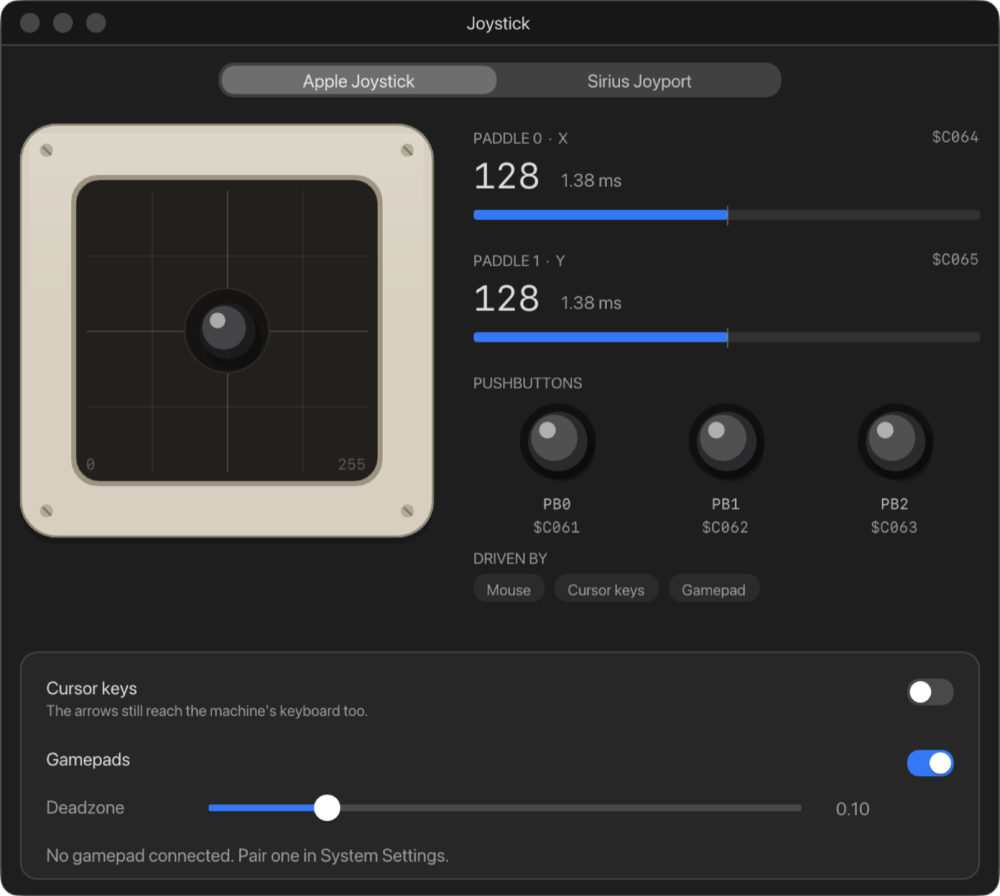

# 3. Keyboard, mouse and joysticks

## When the keyboard is the Apple's

Keys go to the Apple II while the **screen has the keyboard**: click the
screen to give it the keyboard. Keys stop going to the machine when you click
into another ApplEm window, type in a text field, or switch to another app.
Any key held down is let go at that moment, so nothing sticks.

Letters and punctuation follow your Mac's keyboard layout, so an AZERTY,
QWERTZ or Dvorak keyboard types the characters printed on its keys.

## The keys

| Mac key | Apple II |
| --- | --- |
| Return, or Enter on the keypad | Return |
| **delete** | **The left arrow** ($08), which is how Apple II programs erase the character before the cursor |
| forward delete (fn-delete) | The Apple's DELETE key ($7F) |
| esc | Escape |
| tab | Tab |
| ← ↑ → ↓ | The arrow keys |
| ⌃ plus a letter | Control and that letter (⌃C is Control-C) |
| ⌃F12 | Control-Reset (the Mac's F12 alone does nothing) |
| Caps Lock | Caps Lock |
| keypad digits and symbols | The same characters. A IIgs also knows they came from its keypad |

The Mac's function keys, Home, End, Page Up and Page Down have no Apple II
equivalent and type nothing.

On the II Plus every letter is a capital, whatever you type, because the
machine had no lower case.

## Open Apple and Closed Apple

The //e, //c and IIgs have two extra keys beside the space bar: **Open
Apple** and **Closed Apple** (on the IIgs, **Option**). Programs use them as
modifiers and as game buttons. ApplEm maps them in one of two ways, chosen
for each machine with **Machine › Keyboard › Command as Open Apple**:

| | Open Apple | Closed Apple |
| --- | --- | --- |
| **Command as Open Apple off** (II Plus, //e and //c start this way) | Left ⌥ Option | Right ⌥ Option |
| **Command as Open Apple on** (the IIgs starts this way) | ⌘ Command, either side | ⌥ Option, either side |

The status bar reminds you which is in use while the screen has the
keyboard: **⌥ is Open Apple** or **⌘ is Open Apple**.

**While ⌘ is Open Apple, ⌘ belongs to the machine.** With the screen holding
the keyboard, ⌘ shortcuts such as ⌘V, ⌘O and ⌘1 go to the Apple II instead
of ApplEm's menus. Only ⌘Q still quits. Use the menus with the mouse, or
click another window first.

The II Plus has no Apple keys. Its status bar shows **⌥ are the game port
buttons**, because on a II Plus the Option keys press the joystick's
buttons.

## Pasting and copying text

- **Edit › Paste to Machine** (⌘V) types whatever is on the Mac's clipboard
  into the machine. ApplEm waits for the program to read each character
  before typing the next, so nothing is dropped however long the text is.
  Line endings become Returns. Characters the Apple II can't type, such as
  accented letters, are left out.
- **Edit › Copy Screen Text** (⇧⌘C) copies the text on the screen, in 40 or
  80 columns, to the Mac's clipboard.

## The mouse

The //c and IIgs have a mouse built in, and any //e or II Plus with an Apple
Mouse Card fitted (see [Expansion slots](06-expansion-slots.md)) has one too.
On those machines:

1. **Click the screen** to give the Mac's mouse to the Apple II. If the screen
   isn't the window in front, the first click selects it and a second click
   takes the mouse. You can also choose **Machine › Capture Mouse**.
2. The pointer disappears and the mouse moves the Apple's pointer instead. A
   note on the screen says: **Mouse captured. Press ⌃⌥ (Control-Option) to
   release it**.
3. **Press and release ⌃⌥** (Control and Option together, with no other key)
   to get the Mac's pointer back. Switching to another app releases it too.

Only the left button and movement reach the machine.

## Joysticks and paddles

Open the joystick with **Window › Joystick** (⌘4), or the **Joystick**
button in the toolbar. At the top, choose what is plugged into the game
port: an **Apple Joystick**, or a **Sirius Joyport** with two Atari-style
sticks.

### Apple Joystick

The left side shows the stick. Drag the knob with the mouse to move it, and
it springs back to the middle when you let go.

On the right:

- **PADDLE 0 · X** and **PADDLE 1 · Y** show what a program reads from the
  paddles at `$C064` and `$C065`: 0 to 255, with 128 in the middle. The time
  beside each is how long the Apple's paddle timer takes to read that value.
- **PUSHBUTTONS**: **PB0**, **PB1** and **PB2** (at `$C061` to `$C063`).
  Hold one down with the mouse to press it. On a //e, PB0 and PB1 are the
  same lines as Open Apple and Closed Apple.
- **DRIVEN BY**: lights up whichever of **Mouse**, **Cursor keys** or
  **Gamepad** is moving the stick.

The stick can be driven in four ways. If more than one is in use at once,
the first in this list wins:

1. Dragging the stick in the window with the mouse.
2. The arrow keys, when **Cursor keys** is on: each arrow pushes the stick
   all the way.
3. A game controller's left stick. Its **A** and **B** buttons press PB0 and
   PB1.
4. Otherwise the stick rests in the middle.

### Sirius Joyport

The Joyport takes two Atari-style sticks, each with eight directions and a
fire button. The window draws both. Push a stick with the mouse, or click its
red fire button. Lamps under each stick show **UP**, **DN**, **LT**, **RT**
and **FIRE**.

One game controller drives both sticks; two controllers drive one stick each.
The arrow keys drive stick 1.

### Inputs

The card at the bottom of the window holds the settings both kinds share:

- **Cursor keys**: lets the arrow keys move the stick. The arrows still reach
  the machine's keyboard as well, as the note under the switch says. The
  same setting is in **Machine › Keyboard › Cursor Keys as Joystick**, and
  the status bar says so while it is on.
- **Gamepads**: lets game controllers drive the stick. It's on unless you
  turn it off.
- **Deadzone**: how far a controller's stick must move before it counts,
  from 0.00 to 0.50 (0.10 to start with). This helps with sticks that don't
  rest exactly in the middle.

Under these, ApplEm lists each connected controller, with a live view of its
stick and buttons and what it is driving. Controllers are connected in the
Mac's **System Settings › Bluetooth**, or by cable. Any controller macOS
supports works, such as an Xbox, PlayStation or MFi controller.
