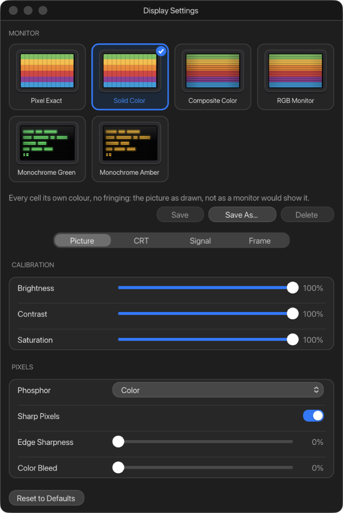

# 4. The display

ApplEm builds the picture the way the real hardware did. The emulated
machine produces the same stream of dots its video circuit sent down the
cable, and ApplEm decodes that signal the way a colour television or monitor
would. Colour on an Apple II comes out of that decoding: the "artefact"
colours of hi-res graphics, the fringes on text, and the way two pixels side
by side blend. So ApplEm's colours behave like a real Apple's. A shader then
draws the monitor: scanlines, the glass, the glow of the phosphor, as much or
as little of it as you like.

## The screen

The picture keeps the Apple's shape as you resize the window. Drag a side or
a corner and the window keeps the right proportions. The green zoom button
makes the window as large as your display allows at that shape.

**View › Full Page** (⌃Esc) gives the whole window to the picture, hiding the
status bar. Right-click the picture for a menu with **Leave Full Page** and
**Display Settings**, or press ⌃Esc again to leave. **View › Enter Full
Screen** (⌃⌘F) uses macOS full screen.

To save the picture as it looks, monitor effects included, choose **File ›
Save Screenshot…** (⌥⌘S). It saves a PNG.

## Display Settings

Open the display settings with **Window › Display Settings**, the **Display**
button in the toolbar, or **ApplEm › Settings…** (⌘,).

**Each machine has its own display settings**, so a IIgs can look one way
and a //e another.

### Monitors

The tiles at the top are complete looks, each modelled on something an Apple
II was plugged into. Click one to switch to it:

| Monitor | What it looks like |
| --- | --- |
| **Pixel Exact** | No monitor at all: sharp square pixels |
| **Solid Color** | Every cell its own colour, with no fringing: the picture as the program drew it, not as a monitor would show it. ApplEm starts with this one |
| **Composite Color** | A colour TV or composite monitor: soft, with artefact colour fringes, a shadow mask and scanlines |
| **RGB Monitor** | Separate colour signals: sharp, with no composite artefacts |
| **Monochrome Green** | A green-screen monitor with a long-lasting P1 phosphor |
| **Monochrome Amber** | An amber monitor (P3 phosphor), the warmer of the two |

Choosing a monitor doesn't change Brightness, Contrast, Saturation, the
Screen Border or the bezel: those stay as you set them.

Change a setting a monitor sets (anything except Brightness, Contrast,
Saturation, the Screen Border and the bezel) and the selection becomes
**Custom**. With one of your own profiles selected, any change marks it as
having unsaved changes. To keep a look you've made:

- **Save As…** saves it as a profile under a name of your choice. Your
  profiles appear as tiles after the built-in ones, and are shared by every
  machine.
- **Save** saves changes back into the profile that is selected. A profile
  with unsaved changes shows a dot after its name.
- **Delete** removes the selected profile. The picture doesn't change.

**Reset to Defaults**, at the bottom of the window, puts this machine's
display back as it started. Your saved profiles are kept.

### The settings

The settings are on four pages: **Picture**, **CRT**, **Signal** and
**Frame**. Every slider runs from 0% to 100%. Hover over a setting's name
for a description, where it has one.

**Picture**

| Setting | What it does | To start with |
| --- | --- | --- |
| Brightness, Contrast, Saturation | Calibrate the picture | 100% each |
| Phosphor | **Color**, or a monochrome tube: **Green**, **Amber** or **White** | Color |
| Sharp Pixels | Keeps each pixel a crisp square when the picture is magnified | On |
| Edge Sharpness | How hard the edge between two pixels is when Sharp Pixels is off. 0 is plain smoothing; 100 keeps each pixel flat | 0% |
| Color Bleed | Colour blending between scanlines, as a tube's phosphors overlap | 0% |

**CRT**

| Setting | What it does | To start with |
| --- | --- | --- |
| Screen Curvature | Curves the glass | 0% |
| Scanlines | Dark gaps between the lines the beam draws | 0% |
| Beam Bloom | How much a bright line's beam widens compared with a dark one's | 60% |
| Phosphor Glow | A soft glow around bright areas | 0% |
| Vignette | Darkens the corners | 0% |
| Burn In | How long the phosphor keeps glowing after the picture changes, leaving a trail behind moving things | 0% |
| Shadow Mask | The pattern of the tube's colour mask | 0% |
| Mask Type | **Aperture Grille** (stripes) or **Shadow Mask** (dots) | Aperture Grille |
| RGB Offset | Separates red, green and blue towards the edges, as a misconverged tube does | 0% |
| Flicker | A slow, gentle wobble in brightness | 0% |

**Signal**

| Setting | What it does | To start with |
| --- | --- | --- |
| Static Noise | Grain over the picture | 0% |
| Jitter | Small random shifts of the picture | 0% |
| Horizontal Sync | Now and then, waves across the picture as the sync wavers | 0% |
| Glowing Line | A faint bright band that rolls slowly down the screen | 0% |
| Ambient Light | Room light reflecting off the glass | 0% |

**Frame**

| Setting | What it does | To start with |
| --- | --- | --- |
| Screen Border | The black border around the picture | 35% on the 8-bit machines, 0% on the IIgs (which draws its own coloured border) |
| Bezel Width | A frame around the screen | 0% |
| Bezel Color | The frame's colour | Beige (#C8B89A) |

Every moving effect is kept slow and gentle, within the limits for
photosensitive viewers: nothing flashes more than three times a second.

**For the experienced:** The monitor tiles also choose how the signal is
decoded: as composite colour (**Composite Color**), as RGB (**RGB
Monitor**), as clean cells (**Solid Color**), as square pixels (**Pixel
Exact**) or as monochrome. The pages below don't have a separate control for
this, so to change the decoding, choose the tile and then adjust the rest.
