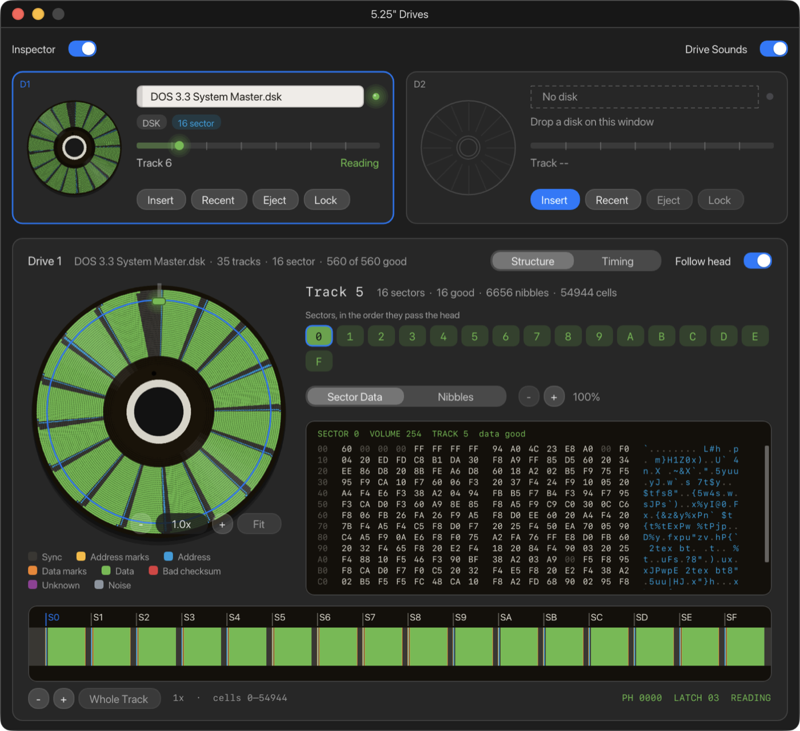
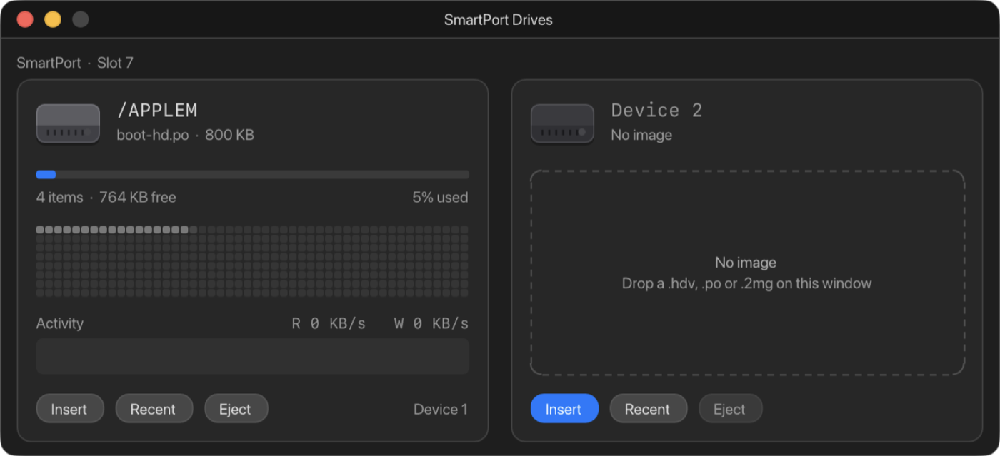

# 5. Disks and drives

ApplEm has three kinds of drive, as the real machines did:

| Drive | Machines | Disk images it takes | Window |
| --- | --- | --- | --- |
| **5.25" floppy** (Disk II, or the //c's and IIgs's built-in drive) | All four | `.dsk`, `.do`, `.po`, `.woz` | **Window › 5.25" Drives** (⌘2) |
| **3.5" floppy** | IIgs | 800K and 400K images (`.po`, `.2mg`, `.dsk`, `.hdv`, `.img`) and 3.5" `.woz` | **Window › 3.5" Drives** |
| **SmartPort hard drive** | IIgs (built in), and a //e or II Plus with a SmartPort card | `.hdv`, `.po`, `.2mg` | **Window › SmartPort Drives** (⌘3) |

## Putting a disk in

There are several ways to put a disk in:

- **Drag a disk image onto any ApplEm window.** ApplEm works out where it
  goes:
  - On a IIgs, an 800K or 400K image goes to a 3.5" drive.
  - A `.hdv` or `.2mg` file, or a `.po` file bigger than 140K, goes to a
    SmartPort device.
  - Any other `.dsk`, `.do`, `.po` or `.woz` file goes to a 5.25" drive.

  Drop it on a drive's card to choose that drive. Drop it anywhere else and
  it goes into the first empty drive, or drive 1 if both are full. While you
  drag over the screen, a label says where the disk will go, for example
  **Drop to insert into Drive 1**.
- **Open a disk image from the Finder** with ApplEm, or drop it on ApplEm's
  icon in the Dock. It goes where a drag would send it.
- **Click Insert** on a drive's card and choose the file.
- **Choose File › Insert in Drive 1…** (⌘O) or **Insert in Drive 2…** (⇧⌘O).
  The File menu also has submenus for 3.5" disks and hard disk images.
- **Click Recent** on a drive's card to put back a disk you used before, or
  one from ApplEm's library.

Putting a disk in a drive doesn't start the machine from it. Choose
**Machine › Reboot** (⌃⌘R) to start from the new disk, as you would restart
a real Apple.

## How changes are saved

When a program writes to a disk that came from a file, **ApplEm writes the
change back to that same file, in that file's own format**. It happens about
a second after the drive stops turning. It also happens when you eject the
disk, replace it, switch machine, load a save state, or quit. ApplEm writes
the new file beside the old one and then swaps them over, so a file is never
left half written.

Two cases need a decision from you:

- **A disk that didn't come from a file**, such as a blank disk or one from
  the library. When it has changed, ApplEm asks before ejecting or replacing
  it: **Save…**, **Don't Save** or **Cancel**. Save lets you choose a name and
  a format: **DOS 3.3 order .dsk**, **ProDOS order .po** or **WOZ .woz**.
- **A change the file's format can't hold.** A `.dsk` or `.po` file holds
  only standard 16-sector tracks. If a program writes something else, for
  example a copy-protected track, ApplEm says so once:

  > What was written to *name* cannot be kept in a .dsk file. Eject it to save it as a WOZ.

  Ejecting then offers to save the disk in a format that can hold it.

When you quit, every disk with a file is written back first. If any disk
still has changes that couldn't be saved, ApplEm lists it and asks: **Quit
Anyway** or **Cancel**.

To stop a program changing a 5.25" disk at all, click **Lock** on its card.
That covers the disk's write-protect notch: the drive refuses to write, and
the file stays as it is. Click **Unlock** to allow writing again.

## The 5.25" Drives window

Each drive has a card, **D1** and **D2**:

- **The disk**, drawn turning at the speed a real Disk II spins (300 rpm)
  while the motor is on. Its colours come from what is recorded on it.
- **The label**, with the file's name. Hover over it for the whole name.
- **The light**, green while reading and red while writing.
- **Chips** describing the disk:
  - the file type (**WOZ**, **DSK**…);
  - the format: **16 sector**, **13 sector** (the older DOS 3.2 format),
    **13 and 16 sector**, or **Unknown format**;
  - **Locked** when write-protected;
  - **Flux** when the disk records exact timing, as some WOZ files do;
  - a count of **unknown** tracks (non-standard ones, often copy
    protection);
  - a count of **bad** sectors that fail their checksum.
- **The track bar**: where the head is, from track 0 to track 34, and
  whether the drive is **Reading**, **Writing**, has its **Motor off**, or is
  **Not selected**.
- **Insert**, **Recent**, **Eject** and **Lock** / **Unlock**.

**Recent** opens a menu with:

- **Blank Disk**: an unformatted disk, for `INIT` in DOS 3.3 or a copy
  program. It isn't added to Recent.
- The last ten disks used in that drive, newest first. Hover over one to see
  where its file is. **Clear Recent** empties the list.
- **Library**: the disks that come with ApplEm.

| Library disk | What it is |
| --- | --- |
| **ProDOS 2.4.3** | A ProDOS system disk with BASIC.SYSTEM |
| **DOS 3.3 System Master** | Apple's DOS 3.3 System Master (January 1983) with Applesoft BASIC |
| **MS CP/M Softcard Disk 1** | CP/M for the Microsoft Z-80 SoftCard (fit the card in [Expansion slots](06-expansion-slots.md)) |
| **ProDOS 2.4.3 HD + Games** | A 32 MB ProDOS hard drive volume with games (in the SmartPort window's library) |

The switches at the top of the window turn on the **Inspector** (below) and
**Drive Sounds**, the click of the head moving from track to track.

ApplEm remembers which disks were in the drives and puts them back next
time, read again from their files. If a file has moved, the drive is left
empty and ApplEm tells you so.

## The Disk Inspector

Turn on **Inspector** at the top of the 5.25" Drives or 3.5" Drives window
to see exactly what is recorded on the disk: every track, every sector, every
byte as it passes the head, and for flux images every magnetic reversal.
Click a drive's card to inspect that drive.

**The platter** on the left shows the whole disk, track 0 on the outside, in
quarter-track steps. While the disk turns, the platter turns with it, and the
head sits at the top on its arm.

- Scroll over the platter to zoom in, up to 400 times. When zoomed, drag to
  move around. The **-**, **+** and **Fit** buttons do the same; double-click
  to see the whole disk again.
- Zoomed in far enough, each ring is shown in full: every nibble as a tile,
  every flux reversal as a tick, and the nibble's value where there is room.
- Hover over the platter for what is there: the track, the nibble or sector,
  and whether its checksum is good.
- Click a track to look at it. That turns off **Follow head**, which
  otherwise moves to whichever track the head is on.

**Structure** and **Timing** at the top choose what the colours mean:

| Structure colour | Meaning |
| --- | --- |
| Grey (Sync) | Sync bytes, the padding between fields |
| Yellow (Address marks) | The marks before and after a sector's address |
| Blue (Address) | The sector's address: volume, track and sector number |
| Orange (Data marks) | The marks before and after a sector's data |
| Green (Data) | The sector's data |
| Red (Bad checksum) | A field whose checksum is wrong |
| Purple (Unknown) | Valid disk bytes outside any standard field, usually copy protection |
| Muted grey (Noise) | Bits that don't form valid disk bytes |

**Timing** colours flux tracks by how long each bit cell lasted: blue for
fast cells, neutral for the nominal 3.91 µs (1.96 µs on 3.5" disks), orange
for slow cells. Tracks without flux timing stay neutral.

**The track** on the right lists the selected track's sectors in the order
they pass the head. A green chip is a good sector. Red means its checksum
failed. Yellow means it has an address but no data. Click a sector to see
it. Below the list:

- **Sector Data** shows the sector's 256 bytes in hex and as characters.
- **Nibbles** shows every nibble on the track, coloured by what it is.
- **-** and **+** (or ⌘-scroll over the table) change the text size.
- **Go to Head** appears when Follow head is off; it returns to the head's
  track.

**The strip** along the bottom unrolls the track from left to right, with the
sectors labelled **S0** to **SF**. Scroll to zoom and drag to move along it;
**Whole Track** shows it all. Zoomed in, you see each cell's flux tick, and
then the 1 or 0 in every cell. At the right is the disk controller's state:
the stepper phases, the data latch, and whether it is reading or writing.

**For the experienced:** For a WOZ 2.1 flux track, the tiles, ticks and cell
times come straight from the recorded flux. That is how disks whose copy
protection depends on timing, such as Sirius's *Bandits*, boot.

## 3.5" disks (IIgs)

The IIgs has two 3.5" drives, in **Window › 3.5" Drives**, or from the
**Disks** toolbar button. Their cards work like the 5.25" ones:

- The disk turns at the speed of the zone the head is in, as a real 3.5"
  drive's does.
- The chips show the ProDOS volume name, **Locked** when the disk is
  write-protected, and **Edited** when it has changed.
- The buttons are **Insert**, **Recent** and **Eject**. There is no Lock
  button, blank disk or library here.

GS/OS and ProDOS can eject a 3.5" disk themselves, as on the real machine.
When they do, ApplEm saves the disk to its file and puts it in the drive's
Recent list, so you can put it back.

3.5" disks belong to the IIgs. If you switch to another machine and back,
they are still in their drives.

## SmartPort hard drives

A SmartPort holds two hard drive images, **Device 1** and **Device 2**. The
IIgs has one built in (slot 5). On a //e or II Plus, fit a **SmartPort** card
in the [Expansion Slots](06-expansion-slots.md) window; the //e has one in
slot 7 unless you change it.

Each device's card shows:

- **The volume name**, such as **/APPLEM**, with the file's name and size.
- **How full the volume is**: the number of files and the space free.
- **A map of its blocks**, block 0 at the top left. Shading shows how much
  of each part is in use. Blocks flash green as they are read and red as they
  are written.
- **Activity**: a graph of the last four seconds of reads and writes, in
  KB/s.

Changes go back to the image's file once the device has been quiet for two
seconds, and on eject, quit and so on, as for floppies. The library under
**Recent** has **ProDOS 2.4.3 HD + Games**. On a IIgs, an image put into an
empty SmartPort while the machine runs can be read at once, but the IIgs can
only start from it after the next Control-Reset or Reboot. The window says
so: **Image inserted. Press Ctrl+Reset or Reboot to start from it.**
