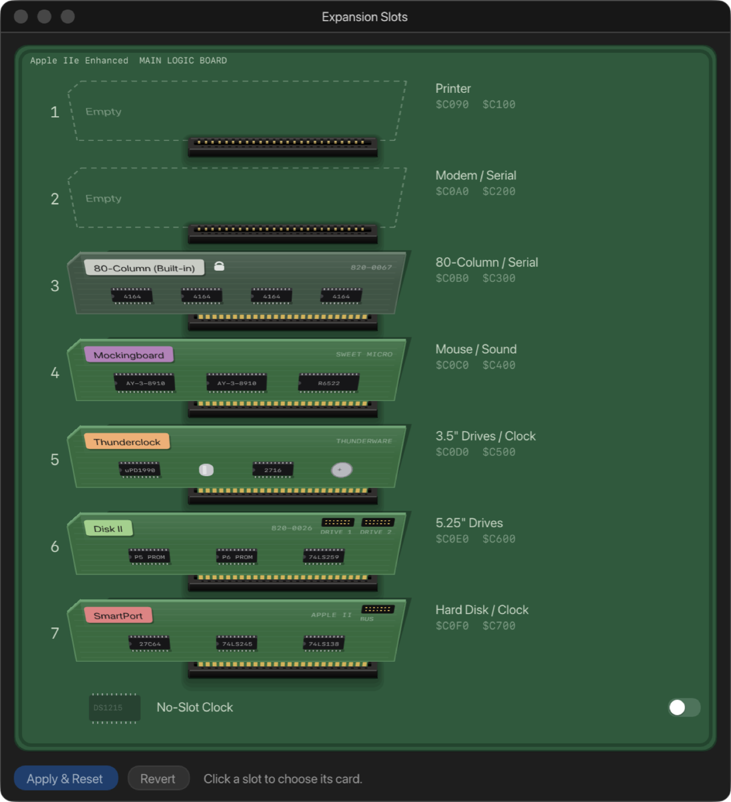

# 6. Expansion slots

The Apple II Plus, //e and IIgs have slots inside for expansion cards: disk
controllers, sound cards, clocks and so on. The **Expansion Slots** window
shows the inside of the machine with the cards in their slots, and lets you
change them. Open it with **Window › Expansion Slots** or the **Slots**
button in the toolbar. The //c has no slots, so it doesn't offer the window.

Each slot is numbered on the left. On the right is what the slot is
conventionally used for, and its addresses: the slot's I/O space (`$C0n0`)
and its ROM (`$Cn00`).

## Changing a card

1. **Click a slot.** A menu lists **Empty** and the cards that can go in that
   slot. A card already fitted elsewhere isn't offered, because each card can
   only be fitted once.
2. **Choose a card.** The slot shows an **ON RESET** tag: the change isn't
   made yet.
3. **Click Apply & Reset.** ApplEm writes any changed disks back to their
   files, fits the cards, and resets the machine so its firmware finds them.

**Revert** throws away changes you haven't applied.

A card drawn in grey with a padlock is part of the machine and can't be
removed, such as the //e's built-in 80-column card in slot 3.

## The cards

| Card | What it is |
| --- | --- |
| **Disk II** | The 5.25" floppy controller, with two drives |
| **Mockingboard** | A sound card with two AY-3-8910 sound chips: six voices of music and effects. See [Sound](08-sound.md) |
| **Thunderclock** | A clock card, giving ProDOS the date and time |
| **Mouse Card** | Apple's mouse interface. See [The mouse](03-keyboard-mouse-joystick.md#the-mouse) |
| **SmartPort** | A hard drive interface for two drive images. See [SmartPort hard drives](05-disks-and-drives.md#smartport-hard-drives) |
| **Z-80 SoftCard** | Microsoft's Z-80 card, for running CP/M |

## Which card goes where

On the **//e** and **II Plus**:

| Slot | Usually | Cards it takes | //e starts with | II Plus starts with |
| --- | --- | --- | --- | --- |
| 0 | 16K RAM | (II Plus only) the language card, fixed | | Language Card |
| 1 | Printer | Z-80 SoftCard | Empty | Empty |
| 2 | Modem / Serial | SmartPort, Z-80 SoftCard | Empty | Empty |
| 3 | 80-Column / Serial | //e: the built-in 80-column card, fixed. II Plus: SmartPort, Z-80 SoftCard | 80-Column (Built-in) | Empty |
| 4 | Mouse / Sound | Mockingboard, Mouse Card, SmartPort, Z-80 SoftCard | Mockingboard | Empty |
| 5 | 3.5" Drives / Clock | Thunderclock, SmartPort, Z-80 SoftCard | Thunderclock | Empty |
| 6 | 5.25" Drives | Disk II | Disk II | Disk II |
| 7 | Hard Disk / Clock | Thunderclock, SmartPort, Z-80 SoftCard | SmartPort | Empty |

Under the slots of a //e or II Plus is a **No-Slot Clock** switch. It fits a
clock chip under the ROM, as the real add-on did, so ProDOS can read the date
without using a slot. It takes effect at once, without a reset.

## The IIgs's slots

On a IIgs, each slot is answered either by a device built into the machine
(its printer and modem ports, its mouse, its SmartPort, its disk port) or by
a card in the slot's socket. Which one answers is the IIgs Control Panel's
choice of **Your Card** or the built-in device for each slot. The window
offers the same choice with a pop-up beside each slot that has a built-in
device (every slot but 3). That pop-up changes
the Control Panel setting, takes effect at once and needs no reset.

A slot answered by its built-in device shows that device with a padlock. A
card fitted in the socket behind it is labelled **IDLE**, because it does
nothing until the slot is set to **Your Card**.

Slots 3 to 7 of a IIgs take a **Mockingboard**, a **Mouse Card** or a
**Thunderclock**. There is no SmartPort card: the IIgs has its own.

## Notes

- **Each machine remembers its own layout.** It is fitted before the machine
  is switched on, so the machine's start-up scan finds the cards.
- **Loading a save state brings its cards with it.** The state's layout
  becomes the machine's layout.
- **For the experienced:** The Super Serial Card and Parallel Card exist in
  ApplEm's core but aren't offered yet, because the Mac app has nothing yet
  to connect them to.
