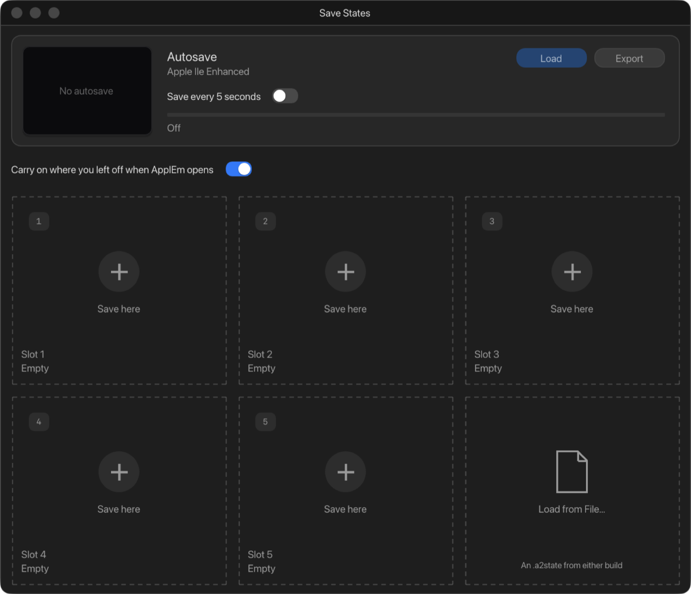

# 7. Save states

A save state is a snapshot of the whole machine: its memory, its processor,
its cards, its screen and the disks in its drives. Load it later and the
machine carries on from the exact moment it was saved, as if it had never
stopped.

Open the window with **Window › Save States** (⇧⌘S) or the **States** button
in the toolbar.

## Carrying on where you left off

**Carry on where you left off when ApplEm opens** is on unless you turn it
off.

- **When you quit,** ApplEm first writes changed disks back to their files,
  then saves the machine.
- **When you next open ApplEm,** it builds the machine as usual (cards,
  disks, power) and then puts the saved machine back over it. The program
  you were running is still running.

This saved machine is used once and then deleted, so it is never stale. It
is skipped in these cases, and ApplEm simply starts afresh:

- **The machine was switched off when you quit.** Nothing is saved.
- **ApplEm didn't quit normally**, for example after a crash. Nothing was
  saved at quit, so there is nothing to carry on from.
- **The machine you open with isn't the one that was saved.**
- **A disk or hard drive file in the drives has been changed since,** for
  example by another program. The saved machine holds the older copy of that
  disk, and putting it back would overwrite your newer file.

## The autosave

The card across the top is the **autosave**. With **Save every 5 seconds**
on, ApplEm saves the machine every five seconds while it is switched on. A
bar fills towards the next save. Autosave is off unless you turn it on.

Each machine has its own autosave. When autosave is on, ApplEm also saves
just before you quit, switch machine or change the IIgs's memory.

- **Load** puts the autosave back.
- **Export** saves it to a `.a2state` file of your choice.
- **Load Last Session** appears when there is one. It is the autosave from
  when ApplEm last quit, kept aside before this session's first autosave
  replaces it.

## The five slots

Below the autosave are five slots, shared by all the machines.

- **Click an empty slot** (**Save here**) to save the machine into it.
- **Hover over a filled slot** for **Load**, **Save** (over this slot),
  **Export** and **Clear**. Right-click it for a menu of the same actions:
  **Load**, **Save Over**, **Export…** and **Clear**.

Each filled slot shows a picture of the screen, the machine that saved it,
and when. The machine's name is shown in orange when loading the state would
mean switching machine.

The sixth card, **Load from File…**, opens a `.a2state` file. A state saved
by the browser version of ApplEm loads here too, and the other way round.
You can also double-click a `.a2state` file in the Finder.

## Loading a state from another machine

A state can only be loaded into the kind of machine that saved it. If it was
saved on a different machine from the one you are using, ApplEm asks:

> *The state* was saved on the Apple IIgs.
> Switching rebuilds the machine; disks and memory now in it are lost.

**Switch and Load** switches machine and loads it; **Cancel** leaves things
as they are.

## What happens to disks

Before a state is loaded, changed disks are written back to their files. The
state then brings its own disks and its own slot cards with it. A disk that
the state puts in a drive has no file to write back to, unless it is the
same disk that is already in that drive. If a program changes it, ApplEm
will ask you to save it, as for a blank disk.

**For the experienced:** States are kept in the `States` folder of ApplEm's
settings folder (see [Files](15-reference.md#where-applem-keeps-things)).
Each one is a `.a2state` file with a `.meta` file (which machine saved it,
and when) and a `.thumb` picture beside it. A state file starts with the
four bytes `A2ES`, then a format version and the machine's number.
