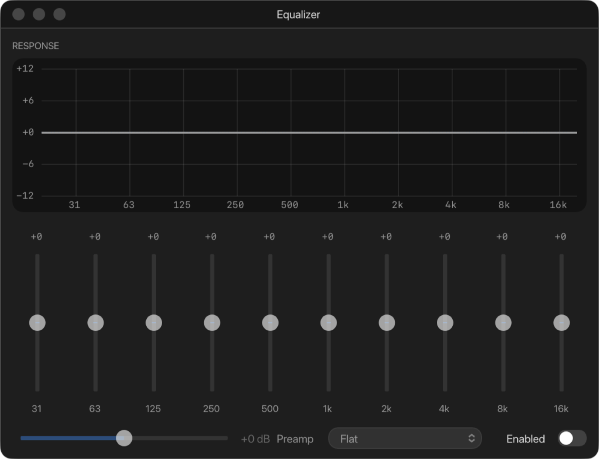

# 8. Sound

Every Apple II has a speaker that programs click to make sound. ApplEm also
emulates the Mockingboard sound card (//e and II Plus, in a slot, and the
IIgs) and the IIgs's Ensoniq synthesiser, with 32 voices. All of it is mixed
together, along with the click of the disk drives, and played through your
Mac. The machine's own sound (the speaker, the Mockingboard and the
Ensoniq) is turned down smoothly in loud passages instead of being clipped,
so it doesn't buzz or crackle when several sources play loudly at once. The
drive clicks and the equaliser come after that, so boosting the equaliser a
long way can still clip.

## Volume

- The **Volume** slider in the status bar sets the level in steps of 5%.
  Moving it also unmutes.
- Click the word **Volume** beside it to mute; it then reads **Muted**.
  Click again to hear the machine.
- **Machine › Sound › Mute** and **Machine › Sound › Volume** (25%, 50%,
  75%, 100%) do the same from the menu.

ApplEm starts at 50%. If your Mac has no sound output, the status bar says
**No audio device** and the machine keeps running at its proper speed
without sound.

## Drive sounds

The 5.25" drives click as their head moves from track to track, as a real
Disk II does. Turn this off with the **Drive Sounds** switch at the top of
the 5.25" Drives window. The clicks follow the main volume and mute.

## The equaliser

**Window › Equalizer**, or **Machine › Sound › Equalizer**, opens a
ten-band graphic equaliser over everything ApplEm plays.

- Turn it on with **Enabled**, at the bottom right. It's off unless you
  turn it on.
- Ten sliders, from 31 Hz to 16 kHz, each boost or cut their band by up to
  12 dB. **Double-click a slider** to put it back to 0.
- The **RESPONSE** graph shows the overall curve.
- **Preamp** raises or lowers the level going into the equaliser, by up to
  12 dB.
- The pop-up offers ready-made curves: **Flat**, **Bass Boost**, **Treble
  Boost**, **Loudness**, **Presence** and **Small Speaker**. It reads
  **Custom** when the sliders match none of them.

## The Mockingboard

The Mockingboard has two sound chips, each with three voices, and many games
use it for music. The //e has one in slot 4 unless you change it (see
[Expansion slots](06-expansion-slots.md)).

Two settings in **Machine › Sound** change how it is played. Phase Lock is on
and Mono is off until you change them. ApplEm remembers them when you quit,
and neither is saved in save states.

- **Mockingboard Phase Lock**: some songs play the same notes on both chips
  at once. On a real card the two chips drift slightly apart, which sounds
  fine from two speakers across a room but can cancel itself out from two
  speakers close together. With Phase Lock on, while the two chips play the
  same thing, the left chip is played on both sides. Turn it off to hear the
  card exactly as it was.
- **Mockingboard Mono**: mixes both chips into both speakers. Off, the first
  chip plays on the left and the second on the right, as on the card.

**Machine › Sound › Mockingboard Chip** chooses the sound chips on the card.
It's also kept when you quit, and isn't saved in save states.

- **AY-3-8910**, the chip the Mockingboard was made with. This is the
  setting unless you change it.
- **YM2149F**, Yamaha's version of the same chip, which fits the same
  socket. It plays the same notes and effects, but its volume has 32 steps
  where the AY-3-8910's has 16. Sounds that fade in and out, or use the
  envelope as a buzzing bass, come out smoother. Its fixed volumes sit on a
  slightly different curve, and volume 0 is very quiet rather than silent.

### The Mockingboard window

**Debug › Mockingboard** (shown only when a Mockingboard is fitted) shows
what the card is doing as it plays:

- **PSG 1** and **PSG 2**, the two sound chips, labelled AY-3-8910 or
  YM2149F to match **Mockingboard Chip**. For each of their
  channels **A**, **B** and **C** it shows:
  - the note and its frequency;
  - whether tone (**T**) and noise (**N**) are on;
  - the volume, or **ENV** when the envelope controls it;
  - a live waveform.

  Click a channel's speaker button to mute it. Mutes are remembered.
- **ENVELOPE** and **NOISE** show the chip's shared envelope shape and noise
  frequency.
- The rows below show each chip's 6522 VIA: its registers, its timer and
  whether it is interrupting the processor.

## The IIgs's Ensoniq

The IIgs's Ensoniq 5503 plays 32 voices (oscillators) from 64K of its own
sound memory. **Debug › Ensoniq** (IIgs only) shows it at work:

- **The chip**: how many oscillators are running, the rate it plays at, its
  interrupt register, and the state of the registers programs use to reach
  it at `$C03C`–`$C03F`.
- **SOUND RAM**: all 64K of sound memory drawn as a waveform, with a lane
  under it for each oscillator that is playing, showing which part of the
  memory it is playing from. Red marks are zero bytes, where an oscillator
  stops. Scroll to zoom and drag to move along; **Fit** shows it all.
- **OSCILLATORS** (turn the list on and off with the **Oscillators** switch):
  each oscillator with its mode, its note, its volume and a picture of the
  wave it is playing. **Show all 32** includes oscillators the chip isn't
  using. The modes are:
  - **FREE**: loops its wave until stopped;
  - **ONE**: plays its wave once and stops;
  - **SYNC**: pairs with its neighbour, to restart it or modulate it;
  - **SWAP**: stops at the end of its wave and starts its partner.
- Click an oscillator to see it in full: its registers, its frequency and
  resolution, and its wave with a playhead. **‹ All oscillators**, or esc,
  goes back to the list.
- Click an oscillator's speaker button to leave it out of the mix.

The chip and sound memory stay in view while the oscillator list scrolls.
