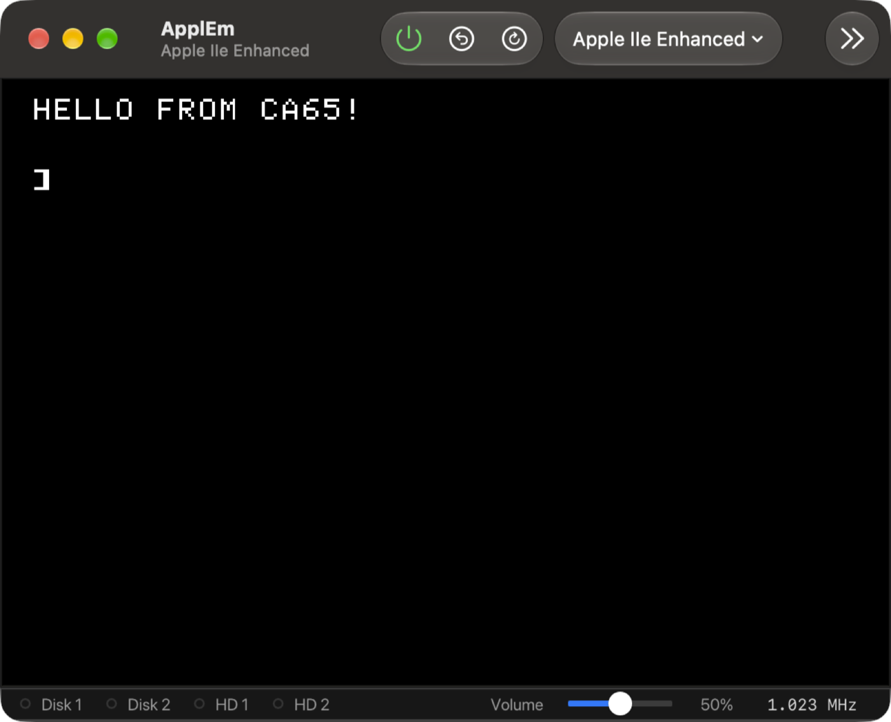
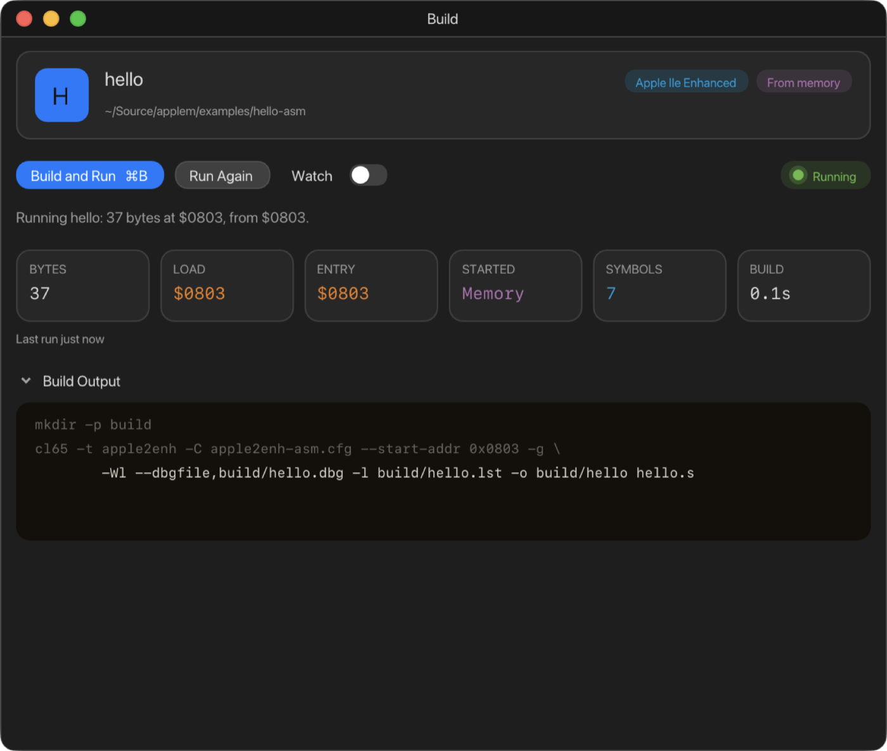
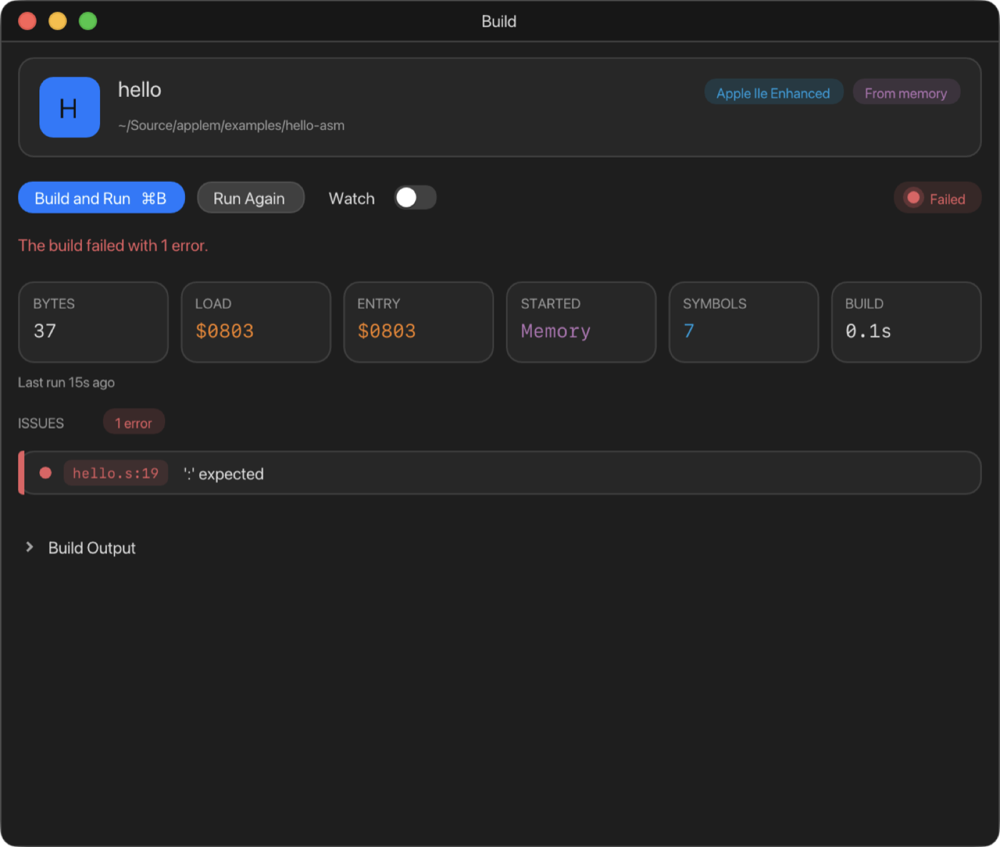
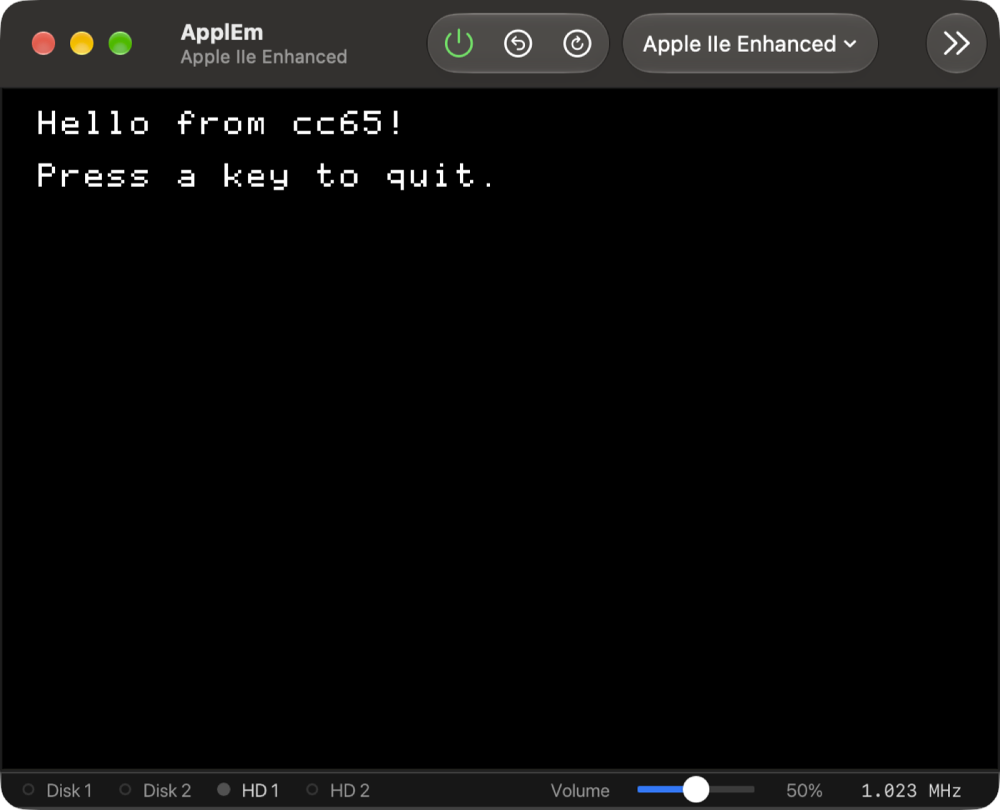
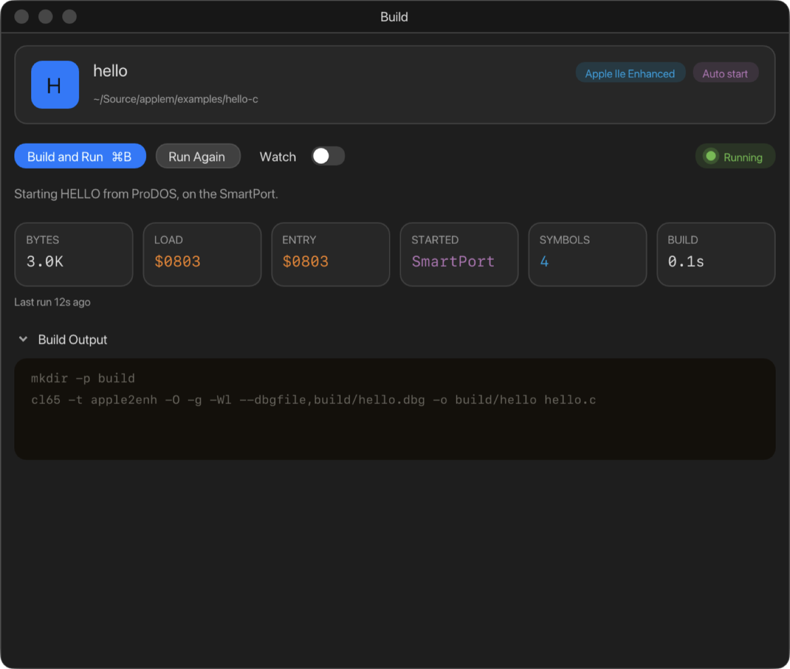
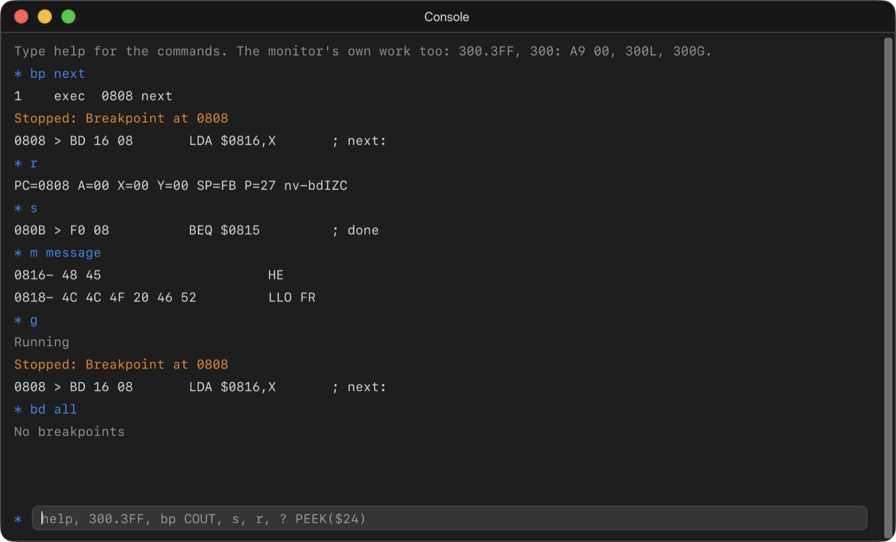
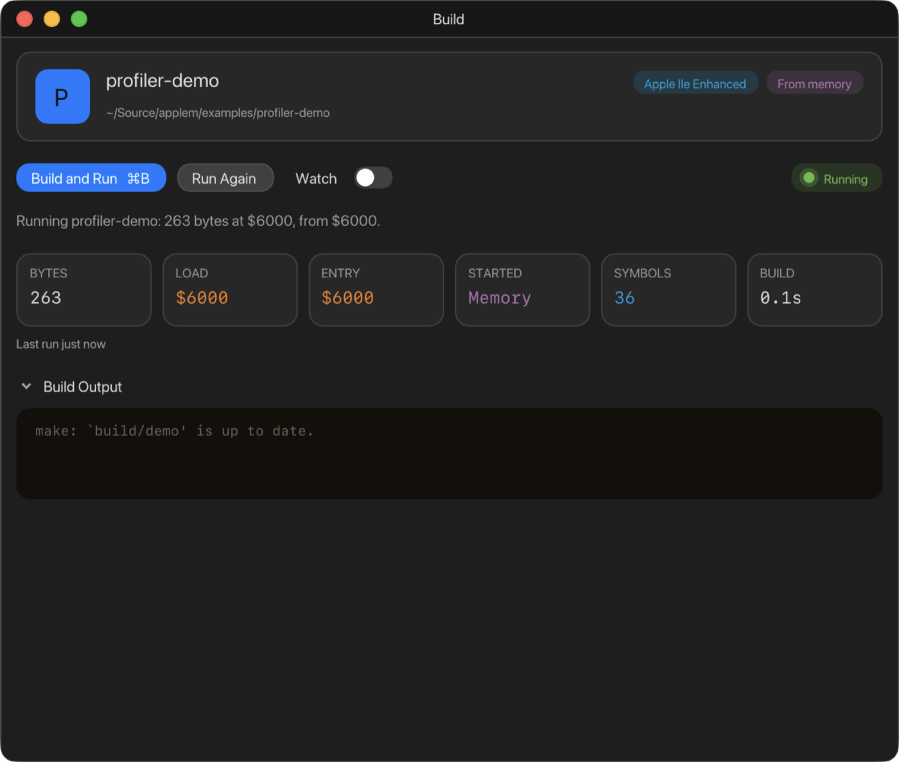
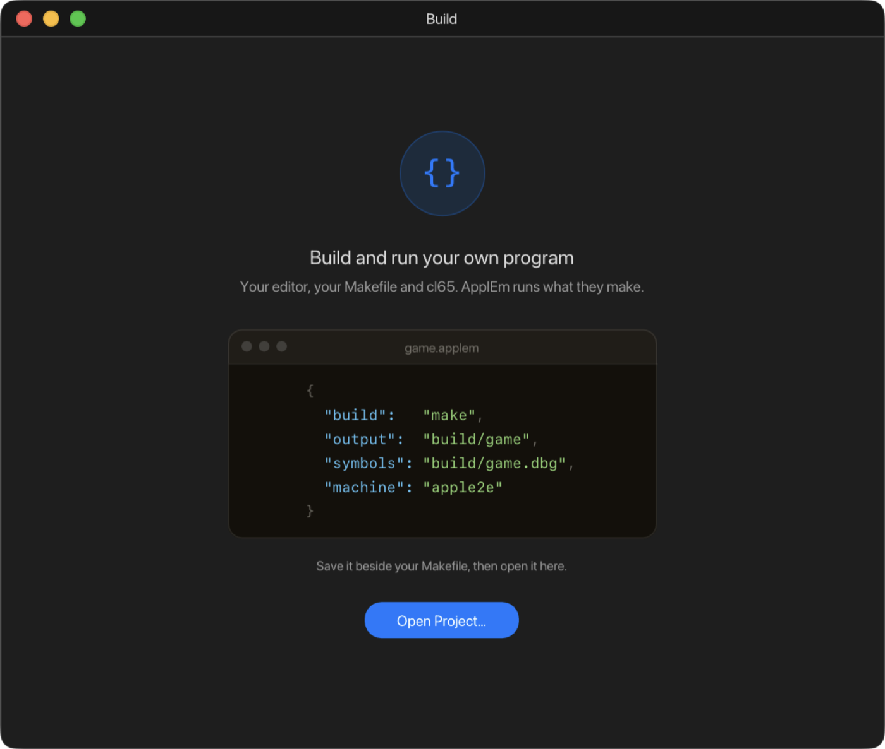

# 9. Building and running your own programs

ApplEm can build a program you are writing and run it on the emulated machine
with a single key, **⌘B**. You write the program in your own editor with your
own tools: ApplEm doesn't replace them. It runs your build command, puts what
the build made into the machine, starts it, and gives the debugger and
profiler the names of your routines and variables.

This chapter starts with what to install, then three tutorials (assembly, C,
and finding a bug), and ends with a complete reference.

## What you need

- **cc65**: the 6502 assembler (ca65), C compiler (cc65) and linker (ld65),
  driven by the `cl65` command. The easiest way to install it is
  [Homebrew](https://brew.sh):

  ```bash
  brew install cc65
  ```

- **make**, if your project uses a Makefile (the examples do). It comes with
  Apple's command line tools, which you can install with:

  ```bash
  xcode-select --install
  ```

ApplEm runs your build in your login shell, with Homebrew's folders
(`/opt/homebrew/bin` and `/usr/local/bin`) added to the front of `PATH`, so
tools installed with Homebrew are found even if your shell setup doesn't add
them. Any other build command works too: a shell script, a Python script, a
different assembler.

## How it fits together

A project is a folder with your source code, a way to build it, usually a
`Makefile`, and a small **project file** whose name ends in `.applem`. The
project file tells ApplEm four things:

```json
{
  "build":   "make",
  "output":  "build/hello",
  "symbols": "build/hello.dbg",
  "machine": "apple2e"
}
```

- **`build`**: the command that builds the program, run in the project's
  folder.
- **`output`**: the file the build makes, the program itself.
- **`symbols`**: ca65's debug file, which gives the debugger your labels.
- **`machine`**: which Apple to run it on.

When you press **⌘B** (**Develop › Build and Run**), ApplEm:

1. runs the build command and collects what it prints;
2. if the build failed, lists the errors and stops;
3. otherwise reads the output file and works out where it goes in memory;
4. switches to the project's machine, if it isn't already running it;
5. gives the debugger the symbols;
6. puts the program in memory and runs it, or, for a program that needs
   ProDOS, makes a ProDOS disk with the program on it and starts the
   machine from that disk.

## Tutorial 1: Hello world in assembly

This tutorial uses the project in
[`examples/hello-asm`](../../examples/hello-asm), one of the
[examples](README.md#the-examples) on GitHub. To follow along from nothing, make a new folder and create the three files below in it.

**`hello.s`**, the program:

```asm
; hello.s - A first program: clear the screen, print a line, return to BASIC
;
; Assembled with ca65 into a raw binary at $0803. ApplEm reads where it loads
; from the debug file the linker writes (build/hello.dbg), puts it there and
; calls it; the RTS at the end returns to Applesoft's ] prompt.

        .setcpu "65C02"

HOME    = $FC58                 ; Monitor: clear the screen, cursor home
COUT    = $FDED                 ; Monitor: print the character in A

        .code
main:   jsr HOME
        ldx #0
next:   lda message,x           ; the next character
        beq done                ; a zero ends the message
        ora #$80                ; the Monitor prints characters with bit 7 set
        jsr COUT
        inx
        bne next
done:   rts

        .rodata
message:
        .byte "HELLO FROM CA65!", $0D, 0
```

The program calls two routines in the Apple's ROM: `HOME` clears the
screen, and `COUT` prints the character in the A register. It prints each
character of `message` until it reaches the zero at the end, then returns
with `RTS`.

**`Makefile`**, how to build it:

```make
build/hello: hello.s
	mkdir -p build
	cl65 -t apple2enh -C apple2enh-asm.cfg --start-addr 0x0803 -g \
	    -Wl --dbgfile,build/hello.dbg -l build/hello.lst -o build/hello hello.s
```

(The indented lines must start with a tab, as `make` requires.) This asks
`cl65` for a plain binary for the enhanced //e (`-t apple2enh -C
apple2enh-asm.cfg`) that loads at `$0803` (`--start-addr 0x0803`), with
debugging information (`-g`) written to `build/hello.dbg`, and a listing in
`build/hello.lst`.

**`hello.applem`**, the project:

```json
{
  "build":   "make",
  "output":  "build/hello",
  "symbols": "build/hello.dbg",
  "machine": "apple2e",
  "start":   "memory"
}
```

`"start": "memory"` says to put the program straight into memory and call
it.

### Run it

1. In ApplEm, choose **Develop › Open Project…** and choose `hello.applem`.
   (Double-clicking `hello.applem` in the Finder does the same.)
2. Press **⌘B**. The **Build** window opens as the project builds. You can
   also open it first with **Develop › Build Window** and click **Build and
   Run**.

The screen clears and shows `HELLO FROM CA65!`, followed by Applesoft's `]`
prompt: your `RTS` returned to BASIC.



The Build window shows what happened:



- **The header** shows the project's name and folder, the machine it runs on
  (**Apple IIe Enhanced**) and how it starts (**From memory**).
- **The status line** says what ApplEm did: **Running hello: 37 bytes at
  $0803, from $0803.**
- **The tiles** show:
  - **BYTES**: the program's size;
  - **LOAD**: where it was put in memory;
  - **ENTRY**: where it was started;
  - **STARTED**: how it was started (**Memory**, **Drive 1** or
    **SmartPort**);
  - **SYMBOLS**: how many names were given to the debugger;
  - **BUILD**: how long the build took.
- **Build Output** shows everything the build printed.

ApplEm found the load address, `$0803`, in the debug file the linker wrote.
The project didn't have to say it.

### Change it

Change the message in `hello.s`, save the file, and press ⌘B again. ApplEm
rebuilds and runs the new version.

### When the build fails

Make a mistake on purpose: change `inx` to `inz`, which isn't a 65C02
instruction, and press ⌘B.



The status reads **Failed**, and **ISSUES** lists each error and warning
with the file and line it is on (`hello.s:19`) and the message. Click an
issue to open the file in its usual editor, at that line. ApplEm can go
straight to the line in Xcode, Visual Studio Code, Sublime Text, BBEdit,
TextMate and Zed. Other editors open the file, so look for the line number
shown. The full
output is under **Build Output**, which is closed while there are issues;
click it to open it.

Errors in the output are coloured red, warnings orange, and the commands
themselves grey. ApplEm understands the error formats of cc65's tools:
`file(line): Error: …` from cc65 2.18 and `file:line: Error: …` from later
versions.

Put `inx` back before you carry on.

## Tutorial 2: Hello world in C

C programs need more than a bare machine: cc65's C runtime expects ProDOS.
ApplEm handles that for you. This tutorial uses
[`examples/hello-c`](../../examples/hello-c).

**`hello.c`**:

```c
#include <stdio.h>
#include <conio.h>

int main(void)
{
    clrscr();
    printf("Hello from cc65!\n\n");
    printf("Press a key to quit.\n");
    cgetc();
    return 0;
}
```

**`Makefile`**:

```make
build/hello: hello.c
	mkdir -p build
	cl65 -t apple2enh -O -g -Wl --dbgfile,build/hello.dbg -o build/hello hello.c
```

**`hello.applem`**:

```json
{
  "build":   "make",
  "output":  "build/hello",
  "symbols": "build/hello.dbg",
  "machine": "apple2e"
}
```

There is no `start` this time, so ApplEm decides for itself (**Auto start**).
Open the project and press ⌘B:





This time the status reads **Starting HELLO from ProDOS, on the SmartPort.**
Here is what happened:

1. `cl65`, without `-C apple2enh-asm.cfg`, makes an **AppleSingle** file: the
   program wrapped with its ProDOS file type and load address. That is the
   normal output for C programs.
2. Seeing an AppleSingle file, ApplEm decided the program needs ProDOS.
3. It made a new ProDOS disk named `/APPLEM` holding the following, all
   copied from the ProDOS 2.4.3 disk that comes with ApplEm, apart from your
   program:
   - `PRODOS`;
   - `BASIC.SYSTEM`;
   - a `STARTUP` program that runs yours;
   - your program, as `HELLO`.
4. It put that disk in the //e's SmartPort (the //e has a SmartPort card in
   slot 7 unless you change it) and restarted the machine from it.

The disk is saved in your project as `.applem/boot-hd.po`. On a machine with
no SmartPort it is a 140K floppy, `.applem/boot.po`, in drive 1. **It
replaces whatever disk was in that drive.**

## Tutorial 3: Finding a bug with the debugger

Your program's labels are in the debugger as soon as it runs. To stop at the
start of `hello.s`'s loop:

1. Choose **Debug › Console** (⇧⌘K).
2. Type `bp next` and press Return. This sets a breakpoint on the label
   `next`.
3. Press ⌘B to build and run again.

The machine stops at `next`, and the Console prints **Stopped: Breakpoint at
0808**. Now try these:

- `r` shows the registers. X is the index into the message, 0 so far.
- `s` runs one instruction and shows the next.
- `m message` shows the bytes of the message, in hex and as text.
- `g` carries on. The loop comes straight back round to `next` for the
  following character, so the machine stops again.
- `bd all` removes the breakpoint. Then `g` runs the program to the end.



Open **Debug › CPU Debugger** (⇧⌘D) to see the same thing as a listing,
with your labels in place of addresses. The [CPU Debugger](10-cpu-debugger.md)
and [Console](12-console.md) chapters cover everything they can do.

For a bigger example, the [`examples/profiler-demo`](../../examples/profiler-demo)
project draws scrolling colour bars and is built to be measured with the
[Profiler](13-profiler.md).



## Working with your own editor: Watch

If your editor builds the project itself, or you prefer to run `make` in a
terminal, turn on **Watch** in the Build window (or **Develop › Watch for
Changes**). ApplEm then runs the program again whenever the **output file**
changes, whatever built it. It waits until the file has stopped changing,
so it doesn't catch it half written.

Watch only looks at the output file. It doesn't build anything, and doesn't
notice changes to your source until something rebuilds.

## The Build window

Open it with **Develop › Build Window**. It also opens by itself when you
build, when something goes wrong, and when you double-click a `.applem` file
in the Finder.

With no project open, it shows a sample project file and an **Open
Project…** button:



With a project open:

- **Build and Run ⌘B** builds and then runs. If the project has no `build`
  command, the button reads **Run** and just runs the existing output.
- **Run Again** runs the output again without building: useful after you've
  changed something in the machine and want a fresh start.
- **Watch**: see above.
- **The status pill**, at the right of that row:
  - **Ready**, or **Watching** when Watch is on;
  - **Building** with the seconds taken so far;
  - **Running**, or **Running, watching**;
  - **Failed**.

The build runs in the background, so ApplEm and the machine keep working
while it does. The output appears when the build finishes. There's no way to
cancel a build from ApplEm, so a build command that never finishes should be
stopped in Terminal.

## The menus

| Menu item | Shortcut | |
| --- | --- | --- |
| **Develop › Open Project…** | ⌥⌘O | Opens a `.applem` file. You can also double-click one in the Finder |
| **Develop › Build and Run** | ⌘B | Builds and runs |
| **Develop › Run Again** | ⌥⌘B | Runs the existing output again |
| **Develop › Watch for Changes** | | Runs again whenever the output file changes |
| **Develop › Build Window** | | Shows or hides the Build window |
| **Develop › Close Project** | | Closes the project |

ApplEm reopens the last project when it starts.

## The project file in full

A project file is a JSON object: names and values in braces, separated by
commas. ApplEm reads a simple form of JSON:

- Each value is a string in double quotes, or a plain number or word
  (`2051`, `true`).
- There are no lists or nested objects.
- Comments and trailing commas aren't allowed.
- A name ApplEm doesn't know is ignored. A name given twice takes its last
  value.
- Paths are relative to the folder holding the project file, unless they
  start with `/`.

| Name | What it is | If you leave it out |
| --- | --- | --- |
| `build` | The command that builds the program. It runs in the project's folder, in your login shell | Nothing is built: ⌘B just runs `output` |
| `output` | The program file the build makes. **Required** | The project won't open |
| `symbols` | ca65's `.dbg` file: your labels for the debugger and profiler, and the program's load address | No new symbols; the debugger keeps the last ones |
| `machine` | `apple2plus`, `apple2e`, `apple2c` or `apple2gs` | Runs on whatever machine is running |
| `start` | `memory`, `disk` or `auto` (see below) | `auto` |
| `load` | The address the program loads at, as `"$0803"`, `"0x0803"` or `2051` | Taken from the file or the `.dbg` (see below) |
| `entry` | The address to start at, in the same forms. Used when starting from memory | The load address |
| `disk` | A ProDOS disk image to take `PRODOS` and `BASIC.SYSTEM` from | The ProDOS 2.4.3 disk that comes with ApplEm |
| `name` | The program's name on the ProDOS disk | The output file's name, made into a valid ProDOS name |

Write an address with a `$` or `0x` in quotes: `"load": "$0803"`. A bare `$0803`
without quotes isn't valid JSON.

### Where the program loads

ApplEm decides the load address in this order:

1. **An AppleSingle file** (cl65's normal output for C, or for assembly
   without `-C …-asm.cfg`): the address recorded in it, unless `load` says
   otherwise. A ProDOS SYSTEM program (file type `$FF`) loads at `$2000`.
2. **`load`** in the project file, if given.
3. **The `.dbg` file**: the start of the lowest segment the linker wrote to
   the output.
4. **A DOS 3.3 binary**: a file whose first four bytes are its load address
   and length.

If none of these says where the program goes, ApplEm stops with **Nothing
says where *file* loads: give the project a "load" address, or its "symbols"
(the .dbg).**

### How the program is started

**`"start": "memory"`** puts the program straight into the machine's main
memory and calls it at `entry`:

- If the machine is off, ApplEm switches it on and gives it a moment to start
  up first.
- On the II Plus, //e and //c, ApplEm presses Control-Reset with the reset
  vector pointing at your program. The firmware sets up the screen and
  keyboard as it does after any reset, then calls your program.
- On the IIgs, the processor is put in 6502 emulation mode with the text
  screen showing, and started at your program.
- Your program is called like a subroutine. When it returns with `RTS`, the
  machine goes to Applesoft BASIC (a cold start, at `$E000`).

**`"start": "disk"`** builds a ProDOS disk and starts the machine from it:

- The disk is 800K on the SmartPort if the machine has one, otherwise a 140K
  floppy in drive 1.
- A SYSTEM program (file type `$FF`) is the only program on the disk with
  `PRODOS`, so ProDOS runs it directly. Its name is given a `.SYSTEM` ending.
- Anything else is run by BASIC.SYSTEM, through a `STARTUP` program, as a
  ProDOS `-` (dash) command runs a file. `entry` isn't used: the program
  starts at its load address.
- The disk is written to the project's `.applem` folder, put in the drive
  (replacing what was there), and the machine is restarted from cold.

**`"start": "auto"`** (or no `start`) chooses `disk` for an AppleSingle file
and `memory` for anything else.

**For the experienced:**

- **Memory starts use a small piece of code at `$02F8`.** It is
  `JSR entry` followed by `JMP $E000`, six bytes at `$02F8`–`$02FD`, and the
  reset vector at `$03F2` points at it. A program that covers any of those
  bytes can't be started from memory, and nothing is written to memory when
  ApplEm refuses it.
- **A program must end below `$C000`,** where the I/O space begins, whichever
  way it starts.
- **Memory starts write to main RAM directly**, whatever the bank switches
  say.

### Symbols

The `.dbg` file's symbols replace the ones from the last import. Labels you
add yourself in the debugger are kept, and take precedence. Data that ca65
marks as data (`.byte`, `.word` and so on) is shown as data in the debugger's
listing instead of being disassembled. Symbols above `$FFFF` aren't imported.

## When something goes wrong

| Message | What it means |
| --- | --- |
| **The project file is not valid JSON (near character *n*).** | A comma or quote is missing or extra near that point |
| **The project does not say what the build makes: give it an "output".** | Add an `output` |
| **"start" is auto, memory or disk, not "…".** | A misspelt `start` |
| **"load" is not an address: "…".** | Write it as `"$0803"`, `"0x0803"` or `2051` |
| **The build failed with *n* errors.** | See **ISSUES** and **Build Output** |
| **The build failed (exit status *n*).** | The build command failed without errors ApplEm recognises: see **Build Output**. Status 127 usually means a command wasn't found |
| **There is nothing at *path* to run. Has it been built?** | The output file doesn't exist. Check `output` matches what the build makes |
| **Nothing says where *file* loads…** | Add `symbols` or `load`; see [Where the program loads](#where-the-program-loads) |
| **The program runs from $*xxxx* past $BFFF, into the I/O space.** | The program is too big for where it loads |
| ***name* loads over $02F8-$02FD, where ApplEm puts the code that calls it: load it elsewhere, or start it from disk.** | Move the program's load address, or use `"start": "disk"` |
| **The project names a machine ApplEm does not have: "…".** | A misspelt `machine` |
| **The system disk has no BASIC.SYSTEM to run a BIN program with.** | The `disk` you named lacks BASIC.SYSTEM |
