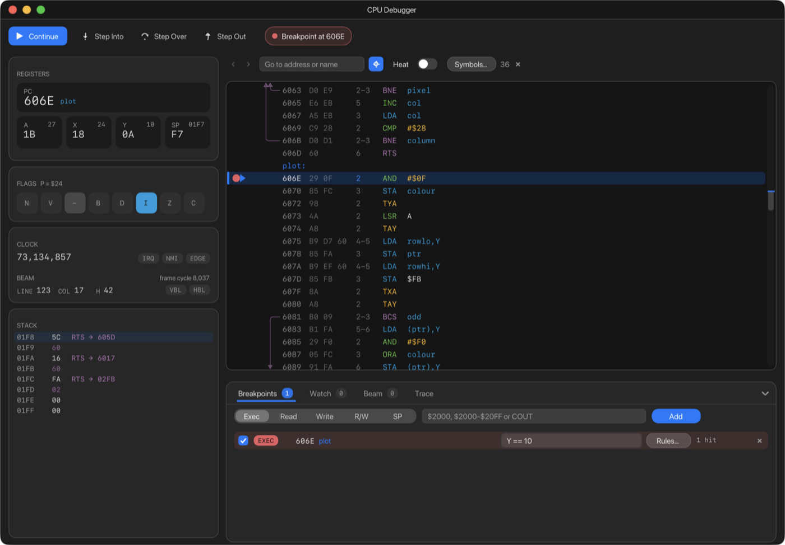

# 10. The CPU Debugger

The CPU Debugger lets you stop the machine, look inside the processor, step
through a program one instruction at a time, and stop when something
particular happens. Open it with **Debug › CPU Debugger** (⇧⌘D).



The window has four parts:

- **The toolbar** across the top: the run controls and the machine's state.
- **The sidebar** on the left: registers, flags, the clock, the video beam
  and the stack.
- **The listing** on the right: the program, disassembled.
- **The panel** underneath: breakpoints, watches, beam breakpoints and the
  trace.

## Running and stopping

| Button | Menu | Keys | What it does |
| --- | --- | --- | --- |
| **Pause** / **Continue** | **Debug › Pause** / **Continue** | F5, or ⌃⌘Y | Stops the machine, or lets it run again |
| **Step Into** | **Debug › Step Into** | F11, or F7 | Runs one instruction |
| **Step Over** | **Debug › Step Over** | F10, or F6 | Runs one instruction, but runs a whole subroutine call (`JSR`) as one step |
| **Step Out** | **Debug › Step Out** | ⇧F11, or F8 | Runs until the current subroutine returns |

macOS uses F11 for Show Desktop, so on most Macs F11 never reaches ApplEm.
Use **F7** to step into and **F8** to step out instead. Depending on your
keyboard settings, you may need to hold **fn** with the function keys.

The capsule beside the buttons says what the machine is doing:

- **Running**, in green;
- **Paused**, **Stepped**, or **Reached *address*** after Run to Here, Step
  Over or Step Out, in amber;
- a breakpoint's stop in red, for example **Breakpoint at 606E**, **Entered
  6000-60FF at 6012** or **Write 0400 ← $A0**.

While the machine is stopped, the toolbar also shows how many cycles ran
since it last stopped: useful for timing a piece of code.

Two more ways to run:

- **Double-click a line** in the listing to run until the machine gets there
  (**Run to Here**).
- **Right-click a line** for a menu that includes **Run to Here** and **Set
  PC Here**.

The debugger keeps checking breakpoints when its window is closed, so a
breakpoint still stops the machine.

## Registers and flags

**REGISTERS** shows the program counter (**PC**) in large type, with the
name of the routine it's in, and the registers **A**, **X**, **Y** and
**SP**. On a IIgs there are also **D** (direct page) and **DB** (data bank),
the PC includes its bank (`00/2000`), and a pill shows whether the 65816 is
in **EMULATION** or **NATIVE** mode.

- The small number at the top right of each register is its value in
  decimal. For SP, it is the stack address SP points at.
- A register that changed since the last stop is highlighted.
- While the machine is stopped, **double-click a register to change it**.
  Type a new value in hex and press Return. Double-click the PC to change
  where the program will carry on; you can type an address or a label name.

**FLAGS** shows the processor's status flags. Each box is lit when the flag
is set:

| Flag | Meaning |
| --- | --- |
| **N** | Negative |
| **V** | Overflow |
| **B** | Break |
| **D** | Decimal mode |
| **I** | Interrupts disabled |
| **Z** | Zero |
| **C** | Carry |

On a IIgs there is an extra **E** box for emulation mode, and in native
mode **M** (accumulator 8-bit) and **X** (index registers 8-bit) replace the
unused bit and B. While stopped, **click a flag to flip it**. E can't be
flipped.

## Clock and beam

- **CLOCK** counts every cycle the processor has run. **IRQ** and **NMI**
  light up while an interrupt is waiting; **EDGE** (6502 machines only)
  lights when an NMI edge has been seen.
- **BEAM** shows where the video beam is: the scanline (**LINE**), the
  column of the visible picture (**COL**, or `--` in the vertical blank), and
  the horizontal position (**H**). **VBL** and **HBL** light up during the
  vertical and horizontal blanking intervals. While the machine is paused, a
  crosshair on the screen marks where the beam is.

## The stack

**STACK** lists what is on the stack, newest at the top. Where two bytes are
a return address pushed by a `JSR`, it is marked **RTS → *address***, with
the routine's name, so you can see the chain of calls that led here. On a
IIgs, `JSL` returns are marked **RTL →**.

## The listing

The listing disassembles memory. Each line shows:

- **the gutter**, where breakpoints and bookmarks are marked;
- **arrows** showing where branches and jumps go;
- **the address** and **the instruction's bytes**;
- **the cycles** the instruction takes. A range such as `2-3` means it takes
  longer if a branch is taken or a page boundary is crossed. On the line
  about to run, the exact count is shown;
- **the instruction**, coloured by kind: branches purple, loads blue,
  arithmetic green, stack operations yellow and flag operations orange.

**Names replace numbers.** A label heads its line (`plot:`), and an operand
that has a name is written as the name: `JSR COUT` instead of `JSR $FDED`.
Hover over a name to see the number. The names come from three places, in
this order:

1. labels you have added (right-click a line, **Add Label…**);
2. your program's symbols, from a ca65 `.dbg` file;
3. ApplEm's built-in names for the Apple II's soft switches, zero page
   locations, and the Monitor and Applesoft entry points in Apple's ROM
   listings, such as `COUT`, `HOME`, `PRBYTE` and `HPLOT`.

On the line about to run, a note shows what the instruction is about to do:
**taken** or **not taken** for a branch, **→ *address*** for a jump, or the
memory location and value it will read or write.

### Moving around

- Type an address (`FDED`, `$FDED`) or a name (`COUT`) in the **Go to
  address or name** field and press Return. On a IIgs you can include a bank:
  `E1/2000`.
- Click the operand of a jump, call or branch (it underlines when you hover)
  to go to where it leads.
- **Back** and **Forward** (⌘[ and ⌘]) retrace where you have been.
- The **crosshair button** (or the Home key) goes back to the PC and follows
  it as the program runs. Scrolling turns following off.
- ↑, ↓, Page Up and Page Down scroll the listing.
- The scrollbar on the right covers the whole 64K. It marks breakpoints in
  red, bookmarks in blue and the PC.

### Breakpoints and bookmarks in the listing

- **Click the gutter** beside a line to set or clear a breakpoint (a red
  dot). **F9** does the same for the selected line.
- **⌘-click the gutter** to set or clear a bookmark. Once there is one, a
  **Bookmarks** button above the listing lists them.

### Selecting lines

Click a line to select it; Shift-click another to select everything between. A
selection shows how many instructions it covers and how many cycles they
take in total.

### The line menu

Right-click a line for:

- **Run to Here**;
- **Set PC Here**;
- **Add Breakpoint** / **Remove Breakpoint**;
- **Add Bookmark**;
- **Go to Target** (for jumps and branches);
- **Add Label…** (or **Rename Label…**);
- **Add Comment…** (or **Edit Comment…**): a comment appears after the
  instruction as `; comment`;
- **Copy Address**.

### Heat

Turn on **Heat** above the listing to see where the program spends its time.
Each line is tinted by how many cycles have been spent on it, yellow through
orange to red. Lines that have never run are dimmed. The **×** beside the
switch starts counting again. On a IIgs the switch is called **Coverage** and
only dims what has never run. For a full breakdown of where the time goes,
use the [Profiler](13-profiler.md).

### Symbols

**Symbols…** imports a symbol file:

- a ca65 `.dbg` file;
- Merlin `EQU` lines;
- ACME `=` lines;
- a plain list of `$ADDR NAME` lines.

A [Build](09-developing.md) project imports its `.dbg` file automatically.
The count of imported symbols is shown beside the button, with an **×** to
forget them.

## Breakpoints

The **Breakpoints** tab in the panel lists every breakpoint and adds new
ones. Choose a kind, type where, and click **Add** (or press Return):

| Kind | Stops when | Type, for example |
| --- | --- | --- |
| **Exec** | the program reaches an address. For a range, when the program *enters* the range from outside it | `$6000`, `$6000-$60FF`, `COUT` |
| **Read** | the processor reads from the address or range | `$C000` |
| **Write** | the processor writes to it | `$0400-$07FF` |
| **R/W** | either | `$24` |
| **SP** | the stack pointer comes into a range, to catch the stack running too deep | `$F0-$FF` (the stack pointer's own value, not `$01F0`) |

Each breakpoint in the list has:

- a checkbox to turn it on and off;
- its kind and where it is;
- a **condition** field (see below);
- **Rules…**, which builds a condition for you;
- how many times it has stopped the machine;
- **×** to delete it.

The breakpoint that stopped the machine is shown in red.

Breakpoints are kept when you quit and when you switch machine. Two other
windows add breakpoints of their own kinds, and they appear in this list too:

- [Soft Switches](11-memory-and-soft-switches.md#soft-switches) adds
  breakpoints on a soft switch changing (**SWITCH**);
- the [Memory Viewer](11-memory-and-soft-switches.md) adds read and write
  breakpoints on whatever you select.

### Conditions

A breakpoint with a condition only stops when the condition is true. Type it
in the breakpoint's condition field:

```
A == $41
X >= 10 && Y < $20
PEEK($24) > 39
DEEK($36) != $FDF0
C == 1 || Z == 1
```

The condition language:

| | |
| --- | --- |
| **Registers** | `A`, `X`, `Y`, `SP`, `PC`, `P` |
| **Flags** | `C`, `Z`, `I`, `D`, `B`, `V`, `N`, each 0 or 1. `X` always means the X register |
| **Memory** | `PEEK(addr)` reads a byte; `DEEK(addr)` reads a two-byte word, low byte first |
| **Applesoft variables** | `BV(n1,n2)`, `BA(n1,n2,i)`, `BA2(n1,n2,i,j)`. The Rules builder writes these for you (see below) |
| **Numbers** | `$41` or `0x41` is hex. **A plain number is decimal**: `10` is ten |
| **Compare** | `==` `!=` `<` `>` `<=` `>=` |
| **Combine** | `&&` (and), `||` (or), and brackets |
| **Arithmetic** | `+` `-` `*` `/` |

Two things work differently from most languages:

- **Arithmetic is worked out strictly left to right**, with no precedence:
  `2+3*4` is 20, not 14. Use brackets: `2+(3*4)`.
- **There are no bit operators** such as `&` or `|`. A single `=` is refused
  with **Use == to compare: A == $41**, and a single `&` with **Use && to
  join conditions**.

If the condition can't be read, its field turns red, and hovering over it
explains why. If a condition causes an error while the program runs, such as
dividing by zero, the machine stops and the stop reason says what went wrong.

### The Rules builder

**Rules…** builds a condition from menus instead of typing it. Each rule
compares one thing with a value:

- **Register**: A, X, Y, SP, PC or P;
- **Flag**: N, V, B, D, I, Z or C;
- **Byte** or **Word** at an address or name;
- **BASIC Var**: an Applesoft variable by name, such as `I`, `SC%` or `A$`;
- **BASIC Array**: an element of an Applesoft array.

Rules are grouped under **Match ALL of the following** or **Match ANY of the
following**; choose ALL or ANY in the heading. **+ Rule** adds a rule and **+
Group** adds a group inside the group. The condition being built is shown
underneath, and **Apply** puts it on the breakpoint.

## Watch

The **Watch** tab shows the value of expressions every time the machine
stops. Type an expression in the same language as conditions, such as `A`,
`PEEK($24)` or `DEEK($36)`, and click **Add**. Values that changed since the
last stop are highlighted.

## Beam breakpoints

The **Beam** tab stops the machine when the video beam reaches a point on
the screen. This is useful for programs that change the display partway
down the screen. Choose:

- **VBL**: as the vertical blank starts, once a frame;
- **HBL**: as each horizontal blank starts;
- **Line**: on a given scanline;
- **Column**: at a given column, every line;
- **Line + Col**: at one exact point.

Up to 16 can be set. To give one a condition, set it in the
[Console](12-console.md) with `bp beam … if …`.

## Trace

The **Trace** tab records every instruction the machine runs. Turn on
**Record**, let the program run, then pause it. The list shows the last
10,000 instructions, the newest last, each with the cycle count, the
instruction, the registers and the flags. A flag letter is in
capitals when the flag is set. **Clear** empties the list.

## What is remembered

Breakpoints and their conditions, watches, bookmarks, your labels and
comments, imported symbols, and the panel's layout are all kept when you
quit ApplEm.
