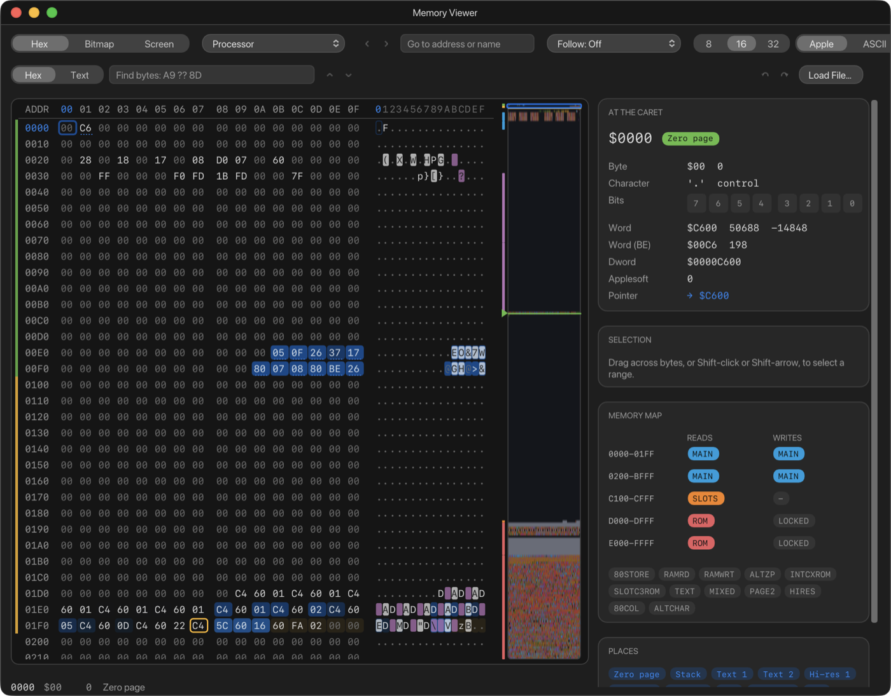
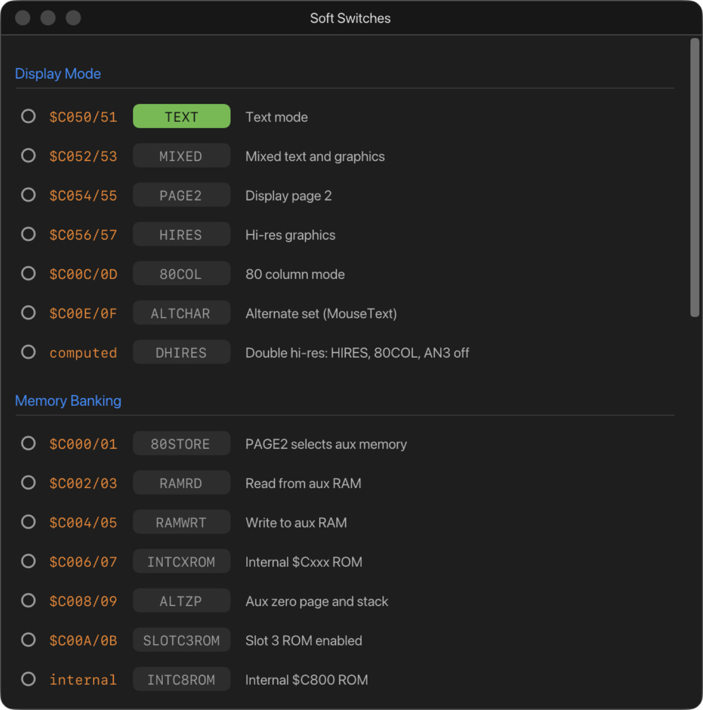

# 11. The Memory Viewer and Soft Switches

## The Memory Viewer

The Memory Viewer shows the machine's memory and lets you change it. Open it
with **Debug › Memory Viewer** (⇧⌘M).

### Which memory

The pop-up beside the view buttons chooses what you are looking at. On the
II Plus, //e and //c:

| Space | What it shows |
| --- | --- |
| **Processor** | Memory as a program sees it right now, with every bank switch as it is set. Breakpoints and activity apply here |
| **Main RAM** | The main 64K itself, whatever the switches say. The language card's two 4K banks for `$D000`–`$DFFF` can't both sit at `$D000`, so bank 1 is shown at `$C000`–`$CFFF` and bank 2 at `$D000` |
| **Auxiliary RAM** | The //e's and //c's second 64K (not on the II Plus) |
| **ROM** | The firmware at `$C000`–`$FFFF`, whatever is switched over it |

On a IIgs, the pop-up lists every bank instead: `$00` and up for fast RAM,
`$E0` and `$E1` for the Mega II's main and auxiliary memory, and the ROM
banks.

Changing memory from the Memory Viewer doesn't flip soft switches or take
any of the machine's time. I/O and ROM can't be written.

### Finding your way

- Type an address or a name in **Go to address or name**, for example
  `$0400`, `9600`, `HIMEM` or `COUT`, and press Return. On a IIgs you can
  include a bank: `E1/2000`.
- **Back** and **Forward** retrace where you've been.
- **PLACES**, in the sidebar, has buttons for the usual areas, such as Zero
  page, Stack, Text 1, Hi-res 1, DOS 3.3, I/O, ROM and the vectors (or, on
  a IIgs, Super Hi-Res and its palettes). Below them are your own bookmarks:
  **Bookmark the Caret** adds one.
- The strip beside the bytes is a map of the whole space, one pixel per byte.
  Click or drag on it to jump. It marks search matches, bookmarks,
  breakpoints, the stack pointer (yellow) and the program counter (green).
- **Follow** keeps something in view as it moves:
  - the **PC**;
  - the **Stack**;
  - an **Expression** that works out an address, for example
    `DEEK($06)` to follow the pointer stored at `$06`–`$07`.

  The expression uses the same language as the debugger's conditions, so
  plain numbers are decimal and arithmetic runs left to right (see
  [Conditions](10-cpu-debugger.md#conditions)). Scrolling or clicking turns
  Follow off.

### Reading the bytes

Each row shows an address, its bytes in hex, and the same bytes as
characters. **8**, **16** or **32** chooses how many bytes are on a row.
**Apple** and **ASCII** choose how characters are shown:

- **Apple** shows them as the Apple's screen would, inverse and flashing
  included.
- **ASCII** shows them as plain 7-bit characters.

Coloured stripes on the left mark the regions of memory: zero page, the
stack, the text and hi-res pages, I/O and ROM. Other marks:

- A byte that changes lights up and fades, so you can watch a program work.
- The instruction at the PC is outlined in green, and the byte at the stack
  pointer in yellow.
- Bytes with a breakpoint on them are tinted.
- A byte with a name is underlined with dots, except for the built-in
  zero-page and soft-switch names, which would mark nearly every byte.

Turn on **Activity** to see, as it happens, every byte the processor reads
(blue) and writes (orange). It's available in the Processor space of the
8-bit machines.

**AT THE CARET**, in the sidebar, explains the byte you have selected:

- its value;
- its character;
- its eight bits: click one to flip it;
- the word, double word and Applesoft floating-point number starting there;
- **Pointer**: the address the two bytes make, with a link to go there.

### Changing memory

- Click a byte and type hex digits. Typing in the character column types
  characters.
- The arrow keys move, Page Up and Page Down move a page, and **Tab**
  switches between the hex and character columns.
- **Undo** and **Redo** buttons, at the right of the search bar, undo your
  edits.
- **Load File…** puts a file's bytes into memory at the caret. A file named
  CiderPress-style, like `NAME#06A000`, loads at the address in its name.

### Selecting and copying

Drag across bytes, or Shift-click, or hold Shift with the arrow keys, to
select a range. **SELECTION** in the sidebar then shows its length, sum,
XOR, CRC-16 and number of zeros, with buttons to:

- **Copy** it as hex;
- **Fill…** it with a byte or a repeating pattern;
- **Save…** it to a file;
- **Watch** it: stop the machine whenever anything writes into it.

Right-click for more:

- **Copy As** writes the bytes as Merlin `HEX` lines, `DFB` directives, a C
  array or text, ready to paste into source code.
- **Paste Hex** writes bytes from the clipboard.
- **Go to Pointer**.
- **Disassemble Here** opens the address in the CPU Debugger.
- **Break on Read**, **Break on Write**, **Break on Access** and **Break on
  Execute** add breakpoints.
- **Add Bookmark**, **Save to File…** and **Load File Here…**.

### Searching

The search bar finds bytes or text:

- **Hex** finds a sequence of bytes, with `??` matching any byte:
  `A9 ?? 8D`.
- **Text** finds text whether its top bit is set or clear, in either case.

Return finds the next match, and the arrows step back and forward.

### Seeing memory as pictures

**Bitmap** shows memory as pixels, to find sprites, fonts and shapes. Choose
the format:

- **Hi-res bytes**: seven pixels a byte, coloured as hi-res is;
- **1 bpp**, **2 bpp**, **4 bpp** or **8 bpp**.

Then choose the width in bytes, **Rows** or **Tiles** (eight bytes down a
column, as font characters are stored) and the zoom. Double-click a byte to
see it in hex.

**Screen** shows a display page as the machine would show it, whatever is on
the screen at the moment: text in 40 or 80 columns, lo-res, double lo-res,
hi-res, double hi-res or Super Hi-Res, page 1 or 2. Click a point to find
the byte that draws it; double-click to see that byte in hex.

## Soft Switches

The Apple II controls its display and memory banking with soft switches:
addresses that change something when a program reads or writes them. The
**Soft Switches** window (**Debug › Soft Switches**) shows every switch the
machine has, and whether it's on.

Each row shows:

- the switch's addresses (`$C050/51` means `$C050` turns it off and `$C051`
  turns it on);
- its name, lit when it's on (green for a switch, blue for a status the
  machine reports);
- what it does.

The switches are grouped:

- **Display Mode**: TEXT, MIXED, PAGE2, HIRES, 80COL, ALTCHAR, DHIRES;
- **Memory Banking**: 80STORE, RAMRD, RAMWRT, INTCXROM, ALTZP, SLOTC3ROM,
  INTC8ROM;
- **Language Card**;
- **Annunciators**;
- **I/O Status**;
- **Buttons**;
- **Keyboard**;
- **Other**: IOUDIS, on the machines that have it.

A IIgs also has **Machine Registers** at the top, such as NEWVIDEO, BORDER,
SHADOW and the speed register CYAREG. Each machine shows only the switches
it has.

### Breaking on a switch

Click the circle at the start of a row to stop the machine when that switch
changes:

- **Break when *name* changes**;
- **Break when it turns on**, or **Break when it turns off**;
- for a register, **when its value, masked, equals** a value you give.

The circle turns red. When the switch moves, the machine stops, and the
window says which instruction moved it, for example **Stopped: PAGE2 on, by
$0803**. These breakpoints also appear in the CPU Debugger's Breakpoints
list, where you can give them a condition, and in the Console's `bl` list.
