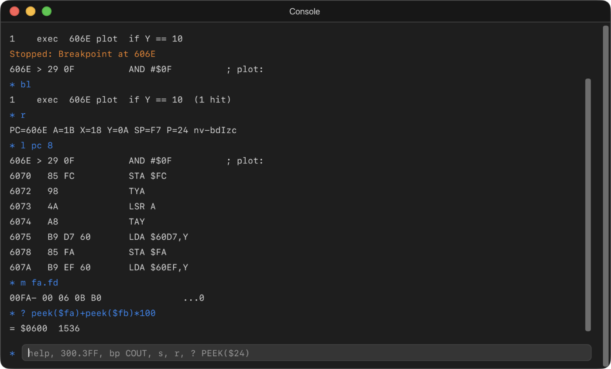

# 12. The Console

The Console is a command line for the debugger. If you know the Apple II's
Monitor (`CALL -151`), you already know half of it: it understands the
Monitor's own way of looking at and changing memory. Open it with **Debug ›
Console** (⇧⌘K).



Type a command and press Return. **↑** and **↓** step through the commands
you've typed before, and are remembered between sessions. **Tab** completes
a command's name, or a label name. **esc** clears the line. Addresses in the
output are links: click one to see it in the CPU Debugger.

Type `help` for the list of commands, or `help` and a command's name for
one command in detail.

## Numbers

**In the Console, every number is hexadecimal**, as in the Monitor: `300`
means `$0300`, and `w 300 10` writes `$10`.

- A `$` in front is allowed: `$300`.
- **`#` in front makes a number decimal**: `#10` is ten.
- **Counts and breakpoint numbers are decimal**: `s 10` steps ten
  instructions, `l 300 40` and `300L 40` list forty lines, `trace 20` shows
  twenty, and `bd 3` deletes breakpoint 3.
- Anywhere an address is wanted, you can give a name instead, such as `COUT`
  or one of your program's labels.
- Anywhere a value is wanted, you can give an expression: `PEEK(24)+1`, `X*2`.
- **A condition after `if` is the exception.** It reads plain numbers as
  decimal, like the CPU Debugger's conditions: `bp 6000 if A == $C1` or
  `if Y == 10`.

If an address spells a command, such as `be` or `c`, put a `$` in front:
`$BE`.

## The Monitor's syntax

| Type | What it does |
| --- | --- |
| `300` | Shows the 8 bytes from `$0300` |
| `300.3FF` | Shows `$0300` to `$03FF` (up to 4K at a time) |
| `300: A9 00 8D` | Writes the bytes from `$0300`, then shows them |
| `300L` | Disassembles 20 instructions from `$0300`. `300L 40` disassembles 40 |
| `300G` | Calls the routine at `$0300`, as the Monitor's `G` does |

On a IIgs, add a bank: `E1/2000.20FF`.

Memory is shown as `0300- A9 00 8D 00 04` with the bytes as characters at
the end.

## Commands

### Memory

| Command | What it does |
| --- | --- |
| `m from[.to]` | Shows memory, like the Monitor's dump. Also `mem`, `dump` |
| `w address byte ...` | Writes bytes, then shows them. Also `write` |
| `f from.to byte` | Fills a range with one byte. Also `fill` |
| `find bytes...` | Searches the processor's 64K (on a IIgs, the program bank) for bytes, with `??` for any byte: `find A9 ?? 8D`. Shows up to 32 matches. Also `search` |
| `find "text"` | Searches for text, ignoring the top bit of each byte. Capitals and small letters must match |

### Running

| Command | What it does |
| --- | --- |
| `g` | Runs. Also `go`, `c`, `continue` |
| `g address` | Calls a routine like the Monitor's `G`. When it returns with `RTS`, the Console prints **Returned from *address*** and the registers it left, then puts the registers back and carries on as before |
| `s [count]` | Steps one instruction, or *count* (up to 100,000). Also `step`, `t` |
| `n` | Steps over a subroutine call. Also `next`, `over` |
| `finish` | Runs until the current subroutine returns. Also `out` |
| `until address` | Runs until the PC reaches an address. Also `to` |
| `pause` | Stops the machine. Also `stop` |
| `reset` | Presses Control-Reset |
| `reboot` | Restarts the machine from cold, as **Machine › Reboot** does |

When the machine stops, the Console prints **Stopped:** and the reason, and
the instruction it stopped at, even if the window was closed.

### Registers and expressions

| Command | What it does |
| --- | --- |
| `r` | Shows the registers: `PC=606E A=1B X=18 Y=0A SP=F7 P=24 nv-bdIzc`. A flag letter in capitals is set. Also `reg`, `regs`, `registers` |
| `r a=42 pc=COUT` | Sets registers. The names are `a`, `x`, `y`, `sp`, `pc` and `p`, plus `pbr`, `dbr` and `d` on a IIgs |
| `? expression` | Works out an expression and prints it in hex and decimal: `? PEEK($24)+1` prints `= $xx  nn`. Also `print`, `p`, `eval` |
| `l [address] [lines]` | Disassembles, from the PC if no address is given. 20 lines unless you say, and at most 200. Also `list`, `u` |
| `stack` | Shows the stack. A pair of bytes that returns to a named routine is marked **RTS to *name***. Also `st` |
| `trace [count]` | Shows the last instructions run (20 unless you say). Turn on **Record** in the CPU Debugger's Trace tab first. Also `tr` |
| `sym name` or `sym address` | Looks up a name's address, or an address's name: `sym COUT` prints `COUT = FDED`, with a description. Also `symbol` |

Expressions use the same language as the CPU Debugger's
[conditions](10-cpu-debugger.md#conditions), except that numbers are hex:
arithmetic runs strictly left to right, so `? 2+3*4` prints `= $14  20`.

### Breakpoints

| Command | What it does |
| --- | --- |
| `bp address` | Stops when the program reaches an address. Also `break`, `b` |
| `bp from-to` | Stops when the program enters a range |
| `bp r address` | Stops on a read. `w` for a write, `rw` for either (also written `read`, `write`, `access`). A range works too: `bp w 400-7FF` |
| `bp sp F0-FF` | Stops when the stack pointer reaches a range |
| `bp ... if condition` | Adds a condition: `bp plot if Y == 10` |
| `bp sw switch [on\|off\|=value\|&mask=value]` | Stops when a soft switch changes (`bp sw page2`), turns on or off (`bp sw text on`), or a register reaches a value (`bp sw border=6`, `bp sw newvideo&80=80`). The names are those in the [Soft Switches](11-memory-and-soft-switches.md#soft-switches) window; for 80COL and 80STORE they are `col80` and `store80` |
| `bp beam vbl` | Stops as the vertical blank starts. Also `hbl`, `line n`, `col n`, or `line,col` for one point. Line and column numbers are decimal |
| `bl` | Lists the breakpoints, by number. Also `breaks` |
| `bd n` / `bd all` | Deletes a breakpoint, or all of them. Also `delete`, `del` |
| `be n` / `be all` | Enables one, or all. Also `enable` |
| `bx n` / `bx all` | Disables one, or all, without deleting them. Also `disable` |

A breakpoint keeps its number when others are deleted, so the numbers in
`bl` stay the same.

A condition is checked when you type it. One that can't be read is refused
with the reason, for example **Condition: Use == to compare: A == $41**.

A switch name the machine doesn't have is kept, with the note **No switch
"…" on this machine; kept for one that has it**. Check the spelling if you
see that.

### The Console itself

| Command | What it does |
| --- | --- |
| `help [command]` | Lists the commands, or explains one. Also `h` |
| `cls` | Clears the Console. Also `clear` |

## A worked example

Using the [profiler demo](../../examples/profiler-demo), built and running:

```
* sym plot
plot = 606E  Imported symbol
* bp plot if Y == 10
1    exec  606E plot  if Y == 10
Stopped: Breakpoint at 606E
606E > 29 0F          AND #$0F         ; plot:
* r
PC=606E A=1B X=18 Y=0A SP=F7 P=24 nv-bdIzc
* l pc 8
606E > 29 0F          AND #$0F         ; plot:
6070   85 FC          STA $FC
...
* m fa.fd
00FA- 00 06 0B B0                      ...0
* bd all
No breakpoints
* g
Running
```
