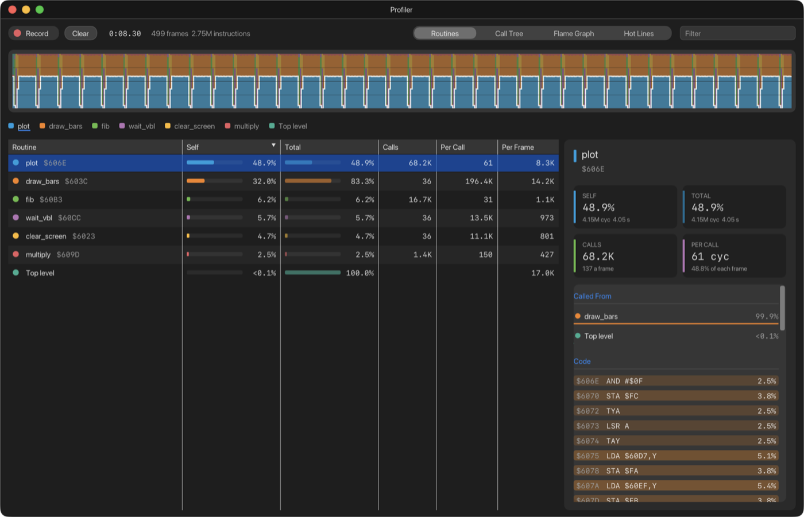
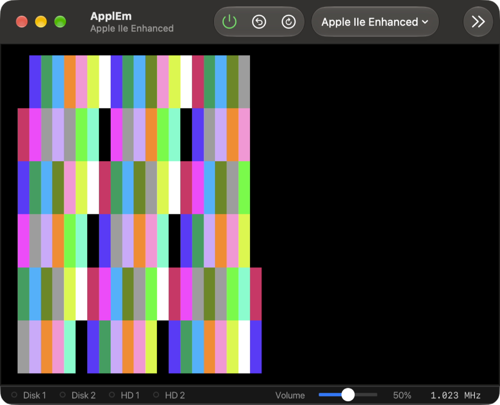
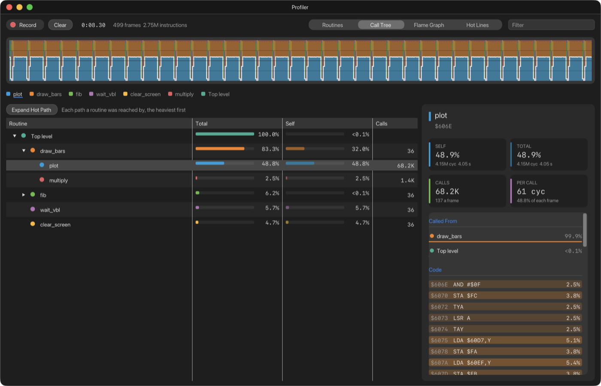
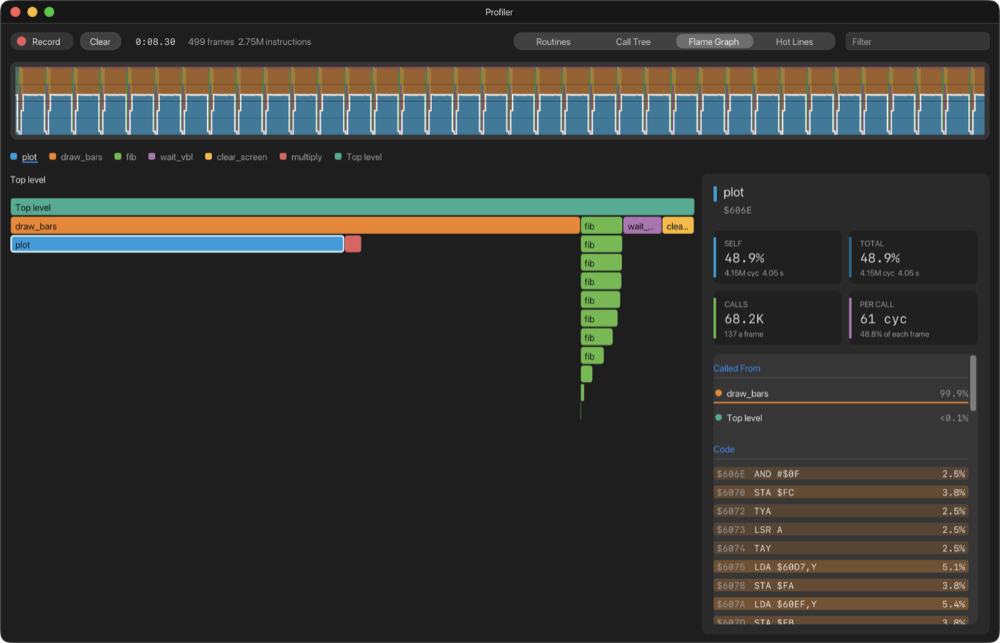
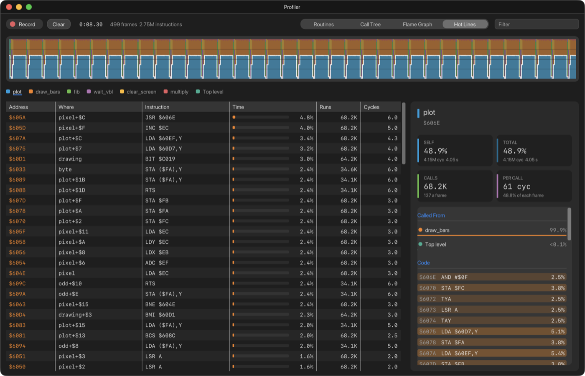

# 13. The Profiler

The Profiler shows where a program spends its time: which routines, which
lines, frame by frame. It counts the processor's own cycles, so the numbers
are exact. Open it with **Debug › Profiler** (⇧⌘P).

## Recording

1. Run the program you want to measure.
2. Click **Record** in the Profiler, or choose **Debug › Start Profiling**
   (⌥⇧⌘R). The button turns red and reads **Stop**, and **REC** shows beside
   the time recorded.
3. Let the program do what you want to measure, for a few seconds.
4. Click **Stop**, or choose **Debug › Stop Profiling**.

Each recording starts afresh. **Clear** throws the recording away. Across the
top you can see how much machine time was recorded and how many frames and
instructions it covers.

### Try it: the profiler demo

The [`examples/profiler-demo`](../../examples/profiler-demo) project is made
for this. It draws scrolling colour bars on the lo-res screen, using routines
that cost very different amounts:

- `plot` plots one pixel and is called 1,920 times a pass;
- `draw_bars` runs the loops around it;
- `clear_screen` is pure waste: it clears a screen that `draw_bars` covers
  completely anyway;
- `fib` works out a Fibonacci number recursively;
- `multiply` is a small shift-and-add multiply;
- `wait_vbl` waits for the vertical blank.

To try it:

1. Open the project with **Develop › Open Project…** and press **⌘B** (see
   [Building and running](09-developing.md)).
2. Record for a few seconds.

Its README lists what you should find: `plot` takes about half the time, and
`clear_screen` about 5%, all of it unnecessary.

## Where the names come from

The Profiler names routines from the CPU Debugger's symbols. Build with
ca65's debug file (see [Building and running](09-developing.md)) and every
routine has its name; without symbols, routines are named by address. The
Apple's ROM routines have their names either way.

A routine is the address a `JSR` called. Code that isn't inside any call is
**Top level**. Interrupt handlers are marked **INTERRUPT**.

## The timeline

The strip across the top has one column for each frame of video (a
sixtieth of a second, or a fiftieth on a PAL machine), split into the colours of the seven routines that took the most
time, plus grey for everything else. Each column shows that frame's time as
100%, so the strip shows how the time is shared, frame by frame. Up to three
minutes of frames are kept.

- **Hover** to see a frame's breakdown.
- **Select a routine** (in the table or in the legend under the strip) and a
  line traces its share of each frame, including the routines it calls. The
  screenshot above shows `plot` selected.
- **Scroll** to zoom in, down to 8 frames at a time. **Swipe sideways**,
  **⌥-drag**, or drag the scroll bar that appears along the bottom to move
  along. **Double-click** to see the whole recording again.
- **Drag across frames** to look at those frames alone. A chip at the top,
  **Frames *a* to *b* ×**, shows the selection; click it, or click once on
  the strip, to go back to the whole recording. The selection applies to the
  Routines, Call Tree and Flame Graph views and the detail panel.

## The views

The buttons at the top right choose one of four views. The **Filter** field
beside them shows only the routines whose names or addresses match.

### Routines

Every routine, the one with the most **Self** time first:

| Column | What it shows |
| --- | --- |
| **Routine** | Its name and address |
| **Self** | The time spent in the routine's own instructions, as a share of the whole |
| **Total** | The time spent in the routine *and everything it calls*. A routine that calls itself is only counted once, so Total never goes over 100% |
| **Calls** | How many times it was called |
| **Per Call** | The cycles each call takes on average, including what it calls |
| **Per Frame** | The cycles it takes in an average frame, including what it calls |

Click a column's heading to sort by it. Click a routine to see its details;
**double-click** it to open it in the CPU Debugger.

### Call Tree

The same time, arranged by the path each routine was reached by: here,
`plot` is called from `draw_bars`, which is called from the top level. Click
the arrows to open and close branches. **Expand Hot Path** opens the most
expensive branch at each level.

### Flame Graph

The call tree as a picture. Each bar is a routine, as wide as its total
time, with the routines it calls underneath. Here, `fib` calling itself
shows as a staircase of `fib` bars. Hover over a bar for its numbers.
**Click a bar** to zoom in so it fills the width; click it again, or press
**esc**, to zoom back out. The trail across the top shows where you are.

### Hot Lines

The 400 most expensive single instructions anywhere:

| Column | What it shows |
| --- | --- |
| **Address** | The instruction's address |
| **Where** | The nearest label before it, such as `plot+$C` |
| **Instruction** | The instruction |
| **Time** | Its share of all the time recorded |
| **Runs** | How many times it ran |
| **Cycles** | The cycles it took each time, on average |

Hot Lines always covers the whole recording, even when frames are selected.
Double-click a line to open it in the CPU Debugger.

## The detail panel

Select a routine and the panel on the right shows:

- **SELF**, **TOTAL**, **CALLS** and **PER CALL**;
- **Called From**: the routines that call it, and how much of its time
  comes from each;
- **Calls**: the routines it calls, and how much time each takes;
- **Code**: its instructions, each shaded by how much of the routine's time
  it takes. Lines that never ran are faint. Click a line to open it in the
  CPU Debugger.

Click a name in Called From or Calls to move to that routine.

## How time is measured

**For the experienced:**

- **Time is in machine cycles.** On a IIgs it is counted in units of the
  1.023 MHz slow clock, so a fast instruction costs less than one cycle, and
  an instruction that had to wait for the slow side costs what the wait
  cost.
- **Calls are followed by watching the stack pointer**, not by matching
  `RTS` with `JSR`. A routine has returned when the stack pointer is back
  where it was before the call. That handles code that uses `RTS` as a jump,
  pulls its return address to read inline data, or resets the stack.
- **The tree is counted from when you press Record.** A routine already
  running at that moment is counted as top level until it returns.
- **Very large recordings are capped.** If a program reaches more than 65,536
  different call paths, **Tree full** appears, and newer paths are charged
  to the deepest path already known.
