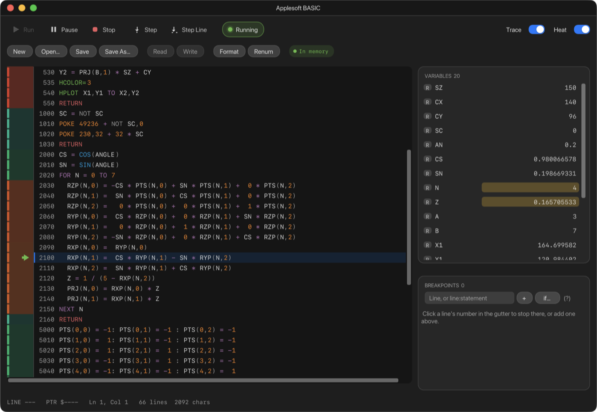
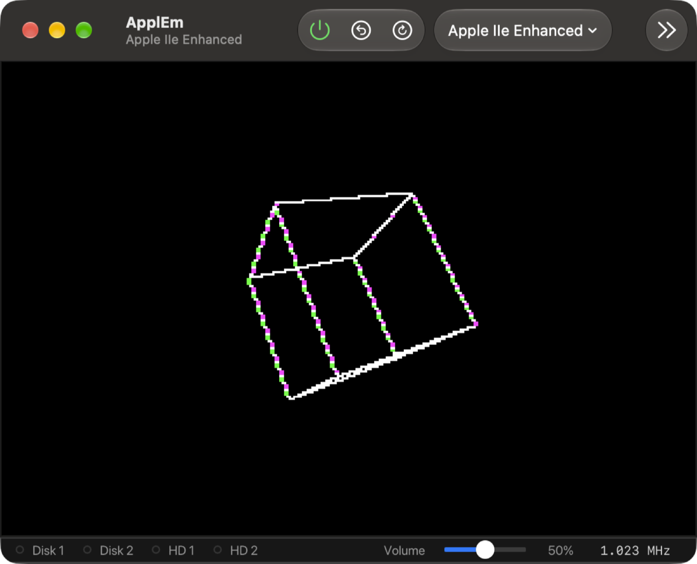
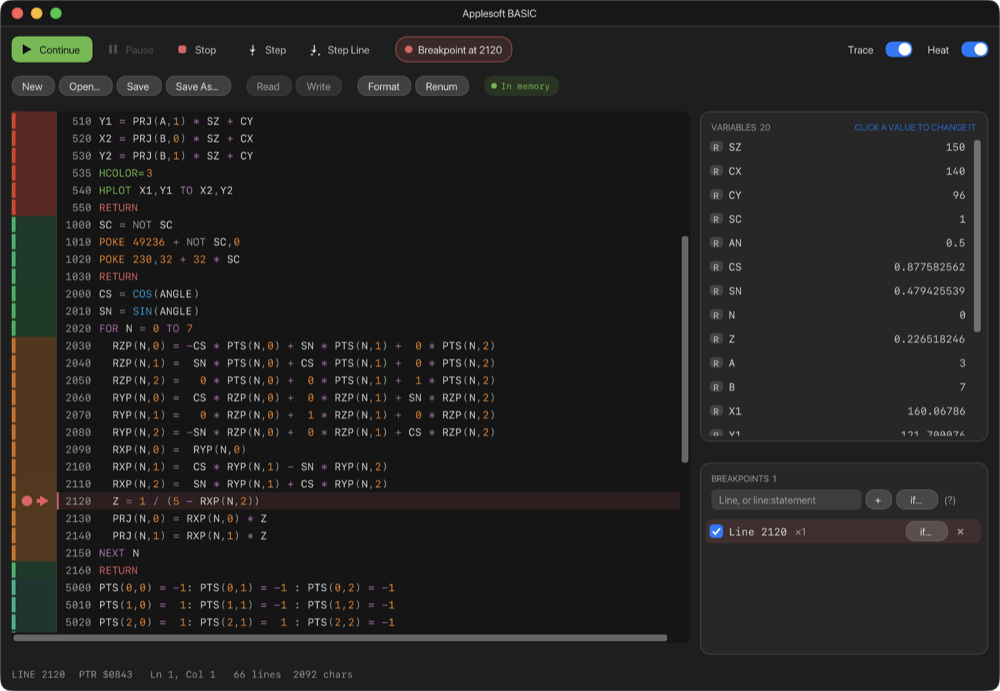

# 14. Applesoft BASIC

The **Applesoft BASIC** window is an editor and debugger for Applesoft
programs. Write a program with syntax colouring and completion, send it to
the machine and run it, then stop it at a line, step through it statement by
statement and watch its variables change. Open it with **Debug › Applesoft
BASIC** (⇧⌘B). It works on the II Plus, //e and //c; the IIgs doesn't offer it.



## A first program

1. Open the window. Make sure the machine is at Applesoft's `]` prompt (press
   ⌃F12 for Control-Reset if a program is running).
2. Type a program in the editor:

   ```basic
   10 FOR I = 1 TO 10
   20 PRINT "LINE "; I
   30 NEXT I
   ```

3. Press **⌘R**, or click **Run**.

ApplEm puts the program into the machine's memory and types `RUN`. The
output appears on the screen, and the **VARIABLES** list on the right shows
`I` counting up.

To try a bigger program, click **Open…** and choose
[`examples/cube.bas`](../../examples/cube.bas), a rotating 3D cube in
hi-res, then press ⌘R.



## The toolbar

The top row runs the program:

| Button | Keys | What it does |
| --- | --- | --- |
| **Run** / **Continue** | ⌘R | Runs the program, writing it into memory first if the editor's copy has changed. While the program is stopped, carries on |
| **Pause** | | Stops at the next statement |
| **Stop** | ⌘. | Stops the program as Control-C does: Applesoft prints `BREAK IN` and returns to `]` |
| **Step** | | Runs one statement and stops |
| **Step Line** | | Runs to the next line and stops |

These keys work while the BASIC window is in front.

The pill beside them says what the program is doing:

- **Idle**, **Running** or **Off** (the machine is switched off);
- when stopped, **Paused at 120**, **Step at 120**, **Breakpoint at 120** or
  **Rule at 120**;
- after an error, the error itself, such as **?SYNTAX ERROR in 40**.

At the right:

- **Trace** follows the line running, scrolling to it and marking it with an
  arrow: green while running, yellow when paused, red at a breakpoint.
- **Heat** shades each line's margin by how often it runs: cool colours for
  lines that run rarely, red for the busiest.

The second row:

- **New** clears the editor. The program in memory isn't touched.
- **Open…** reads a `.bas` or `.txt` file into the editor.
- **Save** and **Save As…** save the editor's program as a `.bas` text file.
- **Read** takes the program that is in the machine's memory into the editor.
- **Write** puts the editor's program into memory, at `$0801` where
  Applesoft keeps it. Read and Write only work at the `]` prompt.
- **Format** sorts the lines by number, lines the numbers up, indents
  `FOR`…`NEXT` loops and puts keywords in capitals. Text in quotes, after
  `REM` and after `DATA` is left as you typed it.
- **Renum** renumbers the program from 10 in steps of 10, changing every
  `GOTO`, `GOSUB`, `THEN`, `ON … GOTO` and `RESUME` to match. Breakpoints
  move with their lines.

The chip at the end says whether the editor and the machine hold the same
program:

| Chip | Meaning |
| --- | --- |
| **In memory** | The editor and memory hold the same program |
| **Edited** | You've changed the editor's copy. Run writes it first |
| **Memory changed** | The program in memory has changed, for example because you typed lines at the `]` prompt. Read takes it |
| **Not in memory** | The editor's program hasn't been written to memory or read from it |

If the editor and memory hold different programs and it isn't clear which
you mean, Run asks: **Write and Run**, **Run Memory** or **Cancel**.

## Editing

- **Line numbers are part of the text**, as in Applesoft. Pressing **Return**
  at the end of a line starts a new line, numbered 10 more than the line
  above (or halfway to the next line, if that number is taken).
  **⇧Return** starts a line with no number.
- Applesoft lines run from 0 to 63999. A number past that is refused.
- **Completion** pops up as you type two or more letters. It offers your
  program's variables first, then its functions, then Applesoft's keywords.
  Under the list are the selected keyword's syntax and a description. After
  `GOTO`, `GOSUB`, `THEN`, `ON … GOTO` or `ONERR GOTO`, typing two digits
  offers your matching line numbers. Choose with ↑ and
  ↓, then press **Tab** or **Return** to accept, or **esc** to close the
  list.
- Keywords are coloured by kind: program flow red, loops purple,
  input/output blue, graphics green, memory orange.
- The editor tidies a line when you leave it, and when you paste.
- The usual Mac editing keys work: ⌘Z and ⇧⌘Z to undo and redo, ⌘C ⌘X ⌘V,
  ⌘A, ⌥← and ⌥→ by word, ⌘← and ⌘→ to the start and end of a line.

**For the experienced:** Colouring finds keywords the way Applesoft's own
tokenizer does, so a variable called `TOTAL` shows as `TO` + `TAL`, just as
Applesoft would read it. That is a warning, not a mistake in the colouring.

## Debugging

### Breakpoints

- **Click a line's margin** to stop when the program reaches that line. A
  red dot marks it. **⌘\\** does the same for the line the cursor is on.
- **⌥-click a statement** to stop at just that statement, when a line has
  several separated by colons. A dashed red line underlines it.
- Or type a line number, or `line:statement`, in the **BREAKPOINTS** field
  and click **+**.



When the program stops, the line is highlighted and the pill shows
**Breakpoint at 2120**. **Continue**, **Step** and **Step Line** carry on
from there.

Each breakpoint in the **BREAKPOINTS** list has a checkbox to turn it on and
off, a count of the times it has stopped the program, **if…** to give it a
condition, and **×** to remove it. A breakpoint with a condition stops only
when the condition is true. Conditions use the CPU Debugger's
[condition language](10-cpu-debugger.md#conditions). **if…** builds them
from menus, including **BASIC Var** and **BASIC Array** rules that compare
an Applesoft variable by name.

**if…** at the top of the list adds a **rule**: a condition that stops the
program on whatever line it becomes true, for example when a variable goes
over a limit.

Breakpoints keep working when the window is closed, and are remembered with
the program.

### Variables

The **VARIABLES** list shows every variable the program has created, with
its value:

- **R** marks a real (floating-point) number, **%** an integer and **$** a
  string.
- A value that has just changed flashes yellow.
- Click an array to open it. A one-dimensional array is shown as a list; a
  two-dimensional one as a table.

While the program is stopped, **click a value to change it**. Type the new
value and press Return.

Applesoft only keeps the first two letters of a variable's name, so a
variable written `ANGLE` in the program is listed as `AN`.

### Errors

If the program stops with an error, its line is marked in red with the
message, such as **?DIVISION BY ZERO**, and the pill shows it too. The mark
goes when you change the line or run again. Errors caught by the program's
own `ONERR GOTO` aren't marked, because the program handles them.

## What is remembered

The editor's program, its file name, the breakpoints and the Trace and Heat
switches are kept when you quit ApplEm, so the program is still there next
time.
